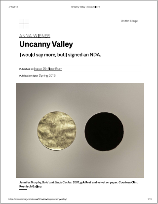
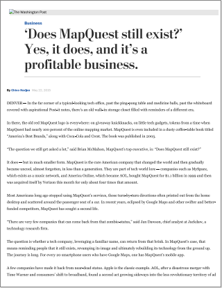
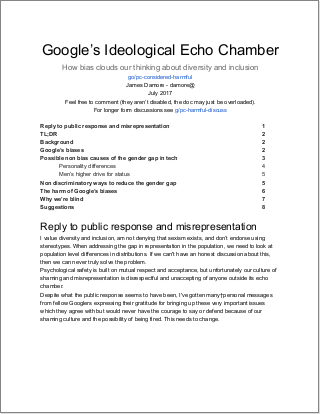
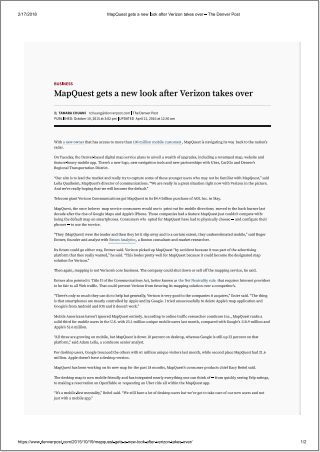
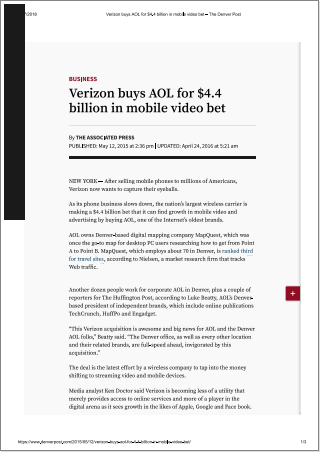
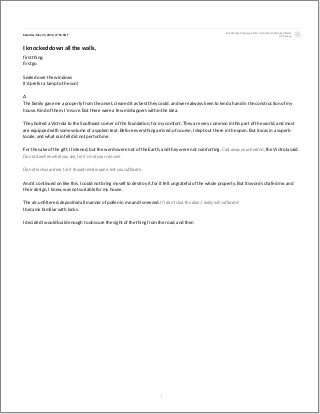
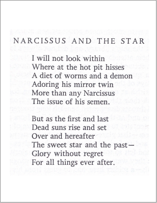

Evernote Export    body, td { font-family: Segoe UI; font-size: 10pt; }  Theodore Pith's Axis of Evil | The Wretched Economist
=====================================================

**Created:**

_5/26/2018 15:55_

**Tags:**

_blimp_

  

I was brought into Theodore Pith's life (or perhaps he was into mine, depending on where your sympathies lie,) by his 

* * * 

Goals for MapQuest
==================

**Created:**

_5/26/2018 09:36_

**Tags:**

_blimp_

  

Week 1: Establish [The Quest](https://www.evernote.com/shard/s36/nl/4017180/eb0979b5-b6e3-4365-a2e2-4f55d02cefc6) - a travel/lifestyle/business reviewing blog to accompany the service.

  

In Q2: Diminish work on the app - transfer manpower so that we can end the Quarter ready to bring in designers for MapQuest 2.0's first abstract studies.

  

By the end of Q2, 2019: Have MapQuest 2.0 tested and ready for deployment.

  

* * *

MapQuest is changing guard and starting The Quest. Meet the new Owner and acting CEO. | The Quest  \[Chapter VIII\]
===================================================================================================================

**Created:**

_5/26/2018 07:43_

**Tags:**

_blimp_

  

**MapQuest is changing guard and launching The Quest. Meet the new Owner and acting CEO.**  
by Theodore Pith, MapQuest Staff

Monday, March 12th, 2018 | 08:30 AM PST

  

Hello MapQuesters!

  

On behalf of AOL, myself, Peter Built, our new COO Lily Tharp, and those two good-for-nothing leaders who deserted this company and stole all off its leftover cash over the weekend, I'd like to express my sincere gratitude for your continued reliance on MapQuest to help you get where you're going. I may only be beginning my second week on this side of the screen, but I've been using MapQuest directions my entire adult life! We have quite a bit in common already, then, and I _can_ tell you that it's _only_ thanks to invested users like yourselves that our jobs are made possible!

  

As well as our thanks, you also have our undivided attention as MapQuest users, so I've launched this blog to 1) provide a better interface between us to make sure our intercommunication with you is as smooth as available resources allow and 2) build a better context on _where_ and _when_ we travel, and why we love the _how_ of getting there! Before continuing, I _am_ now remind you that _The Quest_ is intended for mature readers only and note that you'll need to 1) create an account with us and surrender your date of birth or 2) pledged thrice that you are over the age of 21 each and every visit before you'll be allowed past the Stop Page when it goes live next week, after which you can be sure our team will be holding questionnaires, streaming video, and writing about the future of this new property and of MapQuest as a whole.

  

Now, though, I'd just like to conclude this short update by telling you a bit more about myself. I grew up in Cincinnati with my father who races balloons professionally and never failed to encourage me to _shoot for the clouds_ as a tot... except when the ceiling exceeded 14,000 feet, of course. I developed an obsession with civil infrastructure growing up - public transport, public works, urban development, etc. I spent my allowance for a whole year to become a lifetime member of the Ohio State Civic Historical Society, which was an amazing deal considering the Roundabouts of Ohio calendar I receive, free of charge, every year. Each one contains photographs of the same roundabouts taken from the same angle, corresponding with the same months, but - even after hanging them in my room through 20 editions, now, those roundabouts somehow manage to never disappoint. 

  

I was obsessed with trade journals on electronics hardware as a young man to such an extent that I dropped out of college (having done little to nothing academically for 5 semesters anyway, if I'm honest,) and formed the origins of the research company you know know as Ditto in the basement of my friend's grandparents' old house. And yes, the rumors are true... I did actually pay taxes for a few years under the registered business name Pither, LLC. We saw some _very_ compelling stuff go through that place, and I will no doubt be proud of what we were able to accomplish in my nearly 10 years there for the rest of my life, but a time eventually came when I needed to let my baby bird out of the nest.

  

The decision to invest in MapQuest was a deeply sentimental one - I knew that no other buyer would be willing or able to take this name where it needs to be, and I am inexpressibly thrilled by the opportunity to take it there, especially with the help of such an ace team! Do subscribe to our feed because you'll be hearing from them right here, twice a week.

  

Until next time!

**Theodore Pith**

Chief Executive Officer

* * *

Instructional Laconic Authority - December 30th, 1995
=====================================================

**Created:**

_5/23/2018 06:05_

**Tags:**

_blimp_

**Source:**

[_https://sln.me/_](https://sln.me/)

  

HIGHLY CAPABLE 

PRAGMATIC 

REALISTIC

BOSSY 

HYPOCRITICAL 

CLOSED

  

Those born on December 30 can get their point across with very few words. Usually adherents to established traditions and methods, they put their faith in the tried and true. Extremely valuable people in running a business or organization, they dislike inefficiency and waste of all types. Also, December 30 people quickly recognize faults in systems and work methods, and are adept at eliminating, or at least minimizing them.

  

This does not mean that December 30 people are necessarily up-tight individuals or that they have problems relaxing. On the contrary, few enjoy a good meal or a fun evening with friends more than those born on this day. It is precisely because they have a great deal together at work that they can come home and freely express themselves. December 30 people are gracious and generous, but don’t cross them or oppose their right to rule! Indeed, most born on this day just have to be the boss—there is no other way. They must, however, beware of adopting a know-it-all attitude and dogmatically adhering to fixed principles, which can arouse great antagonism in others.

  

    Not surprisingly, many December 30 people themselves have serious problems with authority, not because they are rebellious per se but rather find those in charge to be incompetent or ineffective. They often begin to think about how they might be able to better run the show themselves. But a good point about December 30 people is that they generally think along constructive, not ego-satisfying, lines. For them the important thing is not power or domination, but that the best job possible be done.

  

    December 30 people hate mess and chaos. Often this leads them to adopt a more spartan existence, or at the very least to stow their possessions in another room and close the door. As they are not overly fastidious, they may choose to limit their accumulation of goods and thereby create less mess. Others may view this as evidence of their being tight with money. Most often this is not the case, for December 30 people know how to spend when they want or need to, even if it means going into the red. Their innate frugality, however, usually keeps them from wasting money and leads them to get the best deal possible.

  

Frustrations and worry can keep December 30 people awake at night. Upsetting situations do not sit very well with their usually taciturn personalities; what suits them best is to work their way out of a given problem. Unfortunately when met with difficult problems caused by another’s ignorance or blundering (as they see it), those born on this day can become extremely agitated. In order not to waste their own precious energy, December 30 people must learn acceptance of that which they cannot change, and the discipline to turn their thoughts to more constructive matters.

* * *

Uncanny Valley | Anna Wiener
============================

**Created:**

_4/20/2018 00:39_

**Tags:**

_blimp_

  

  

* * *

Chapter VI
==========

**Created:**

_3/14/2018 22:20_

**Tags:**

_blimp_

**Source:**

[_https://d.docs.live.net/c9b856386ae1bed0/Documents/David's%20Notebook/blimpsburden.docx_](https://d.docs.live.net/c9b856386ae1bed0/Documents/David's%20Notebook/blimpsburden.docx)

  

The Obits Room is the first stop of Lenny Lather's tour of The Nice, Big Estate

  

Two days after they’d taken the third wheel, Theodore mailed to the store’s main address an anonymous bundle of cash totaling almost three times the sum value of the cheese “in interest,” which included a long, sappy letter addressed personally to the Artisan and went on and on about how he – the mastermind – had discovered in his crime the magic of her art, stating and restating in outpouring artisanal prose why she should never be afraid to put so much of herself in her perfect medium of expression – titanic wheels of five-figure cheese.

“It’s not as if getting caught wouldn’t have been the absolute pinnacle of the thing,” he had suggested to Lenny that night over an uncharacteristically serene scotch in front of an uncharacteristically cozy wood and what had seemed to be – under all reasonable scrutiny – an uncharacteristically reflective and relatively sober Theodore Pith compared to the impressively consistent inconsistencies he’d been so far growing to expect.

“Imagine being tried and convicted for stealing cheese and forevermore knowing you could choose to introduce yourself with the story of your brief, prolific success in a most 18th\-century crime, and back it up with transcripts, newspaper clippings – even TV news stories, if you can pull it off… or, making for yourself the temporary obligation to explain in a job interview that yes, you did indeed have a recent criminal conviction on your record… for running out with three wheels of cheese from the same place in the same store within the same month.”

The noise of his own sobriety had been like a beehive with a tide in the back of his head, pulsing, ebbing, spiking, then fading – a buzzing multitude of footprints were the withdrawals left there by a diverse nature of substances. Some were more tangibly linked to physical sensations of vocally-specific need, as nicotine so quickly becomes and as alcohol shall be, one day, if you explicitly and repeatedly overdo it. Others left equally unpleasant sensations that could be – to the body – of an unknown cause entirely, like the sharpness of certain amphetamines, which we one can only miss consciously.

“So, yes, incrimination and money are both more or less inconsequential, but why the apology?” he had asked through a dip in the amplitude of the tide. The scotch had seemed to be treating something. He had felt most of it in his toes.

“And such an extensive apology… Was it guilt? Or do you just get off on your raw insincerity so blissfully that those hours of your time couldn’t have been spent on a single more pleasurable activity than writing a bullshit apology to a woman you’ve never met in which you expertly validate a worldview and a set of preferences that couldn’t possibly differ any more from your own?”

“Both and neither,” Theodore had replied, pouring the last quarter of the bottle between them.

“Guilt is nothing but regretful incompetence, which – depending on the perspective from which you classify – I may or may not experience or act from. From my own, I would argue that mitigating the possible damage done collaterally by a stunt like this is effort owed to my own vanity irrespective of the wellbeing of however many cheese-obsessive people may have been affected or not. Inadvertently harming some person or persons seriously – in spirit, mind, body, or all three – while spinning around a brass-headed cane and playing with a slippery monocle is just embarrassingly sloppy, primarily – and by its nature dull, unoriginal, and unnecessary.

“My ability to balance out unforeseen consequences of my exploits is satisfying if only in its reinforcement of my control over my own impact on my environment. Theft as an abstract is always going to make the thief look weak in the end, no matter how much he may or may not be aggrandized in popular culture. Violence is vulgar, brutish, and uncivilized. Anybody can demoralize, steal from, or beat up anyone who happens to have less power at that moment – the power to alter perception, though, is the ultimate entertainment device.”

* * *

Obituary: Percy Hole \[Chapter VI\]
===================================

**Created:**

_3/13/2018 16:08_

**Tags:**

_blimp_

**Source:**

[_https://www.nytimes.com/2017/12/21/obituaries/janet-elder-a-top-editor-at-the-times-is-dead-at-61.html_](https://www.nytimes.com/2017/12/21/obituaries/janet-elder-a-top-editor-at-the-times-is-dead-at-61.html)

  

"[Janet Elder, a Top Editor at The Times, Dies at 61](https://www.nytimes.com/2017/12/21/obituaries/janet-elder-a-top-editor-at-the-times-is-dead-at-61.html)" - The New York Times ([local backup](file:///C:/Users/David%20Blue/Documents/Pith/janetelderobituary-thenewyorktimes.pdf))

  

An ancestor of Jeremy Clarkson, as found out on Who Do You Think You Are?

  

"PIVOT TO VIDEO"

* * *

“Percy Hole, Editor at The Sun, Dies Pursuing Rock Springs Story”

By Percy Hole

  

Percy Hole, who in his seven years at The Sun contributed in no small part to its resolute commitment to the Superior community throughout a key period of change and transition, died nobly on Wednesday in Rock Springs while pursuing a story fraught with sensitive historical currents to which he had committed himself for the better part of the past year. He was 29.

  

Stuart Stud, the Editor-in-Chief of The Sun, announced the death to the staff Thursday morning. Mr. Hole, who had moved to Superior after being scouted by the paper upon receiving his bachelor's degree in fly fishing from New York University, succumbed to a catastrophic failure of his liver after allegedly "consuming a far greater-than-recreational quantity" of alcohol during an informal interview with an auxiliary source, according to someone familiar with the matter within the Sweetwater County Coroner's Office.

  

In title, Mr. Hole climbed quickly from Sports Editor to Executive Daily Editor, but colleagues cited several integral, unpaid roles beyond his official functions in the newsroom.

  

"He was a real winner," said Hilary Hutch, who Hole had groomed personally to replace him as Sports Editor, "by far the sexist human being to grace this pokey office. An impossible talent. We were so lucky to be work alongside him for so long. There was no better wordsmith in the whole industry. He definitely deserved a huge raise. A true legend."

  

His responsibilities as Executive Daily Editor included arranging the entirety of The Sun's print edition singlehandedly every morning, answering every staffer question with heroic brevity, captaining the paper's infallible ethical prestige, editing all copy with an eye matched by not a one of his contemporaries, lifting and carrying all materials and equipment over 150 lbs. along with the entirety of the office's championship-winning, regionally competitive basketball team as point guard.

  

"I've never seen anyone move like that," said Ms. Hutch of her experiences playing on the team, "it was like he was some kind of super-evolved proto-human. We were really just baggage, mostly - decoration - but he was generous and humble about it. He never hogged the glory even though he almost always had every right to."

  

Mr. Hole's colleagues also described his stellar performance and natural talent as generally unappreciated in bolstering The Sun's late entrance into digital publishing and web 2.0.

  

"Pivot to video," said Mr. Stud.

* * *

Pith's Properties \[BACKGROUND\]
================================

**Created:**

_3/13/2018 13:24_

**Tags:**

_blimp_

**Source:**

[_https://d.docs.live.net/c9b856386ae1bed0/Documents/David's%20Notebook/blimpsburden.docx_](https://d.docs.live.net/c9b856386ae1bed0/Documents/David's%20Notebook/blimpsburden.docx)

  

  

In a maniacal frenzy in late-2015, Pith had purchased eight struggling little newsrooms in various states of neglect: The Lupus Ledger, The Columbus (Alabama) Chronicle, The Cadence, Maryville, and Elk Mountain Times, The Kaycee Daily, The Lyman Register, and The Superior Sun. One of his favorite pastimes was drafting & mailing one or two of them an occasional brutally, obviously-plagiarius op-ed under an assumed (and utterly ridiculous) name, before separately demanding through the bureaucracy that they be published in order to launch the staff into an editorial, ethically-trying nightmare. If they gave in, he won the game – if not, they’d be (sometimes literally) backslapped and congratulated to no end.

  

The Lupus Ledger - Lupus, Missouri

The Maryville Times - Maryville, Missouri

The Columbus Chronicle - Columbus, Alabama

The Cadence Times - Cadence, Kansas (Fictional)

The Elk Mountain Times  - Elk Mountain, Wyoming

The Kaycee Daily - Kaycee, Wyoming

The Lyman Register - Lyman, Wyoming

The Superior Sun - Superior, Wyoming

  

[MapQuest](https://www.evernote.com/shard/s36/nl/4017180/0fed9bed-5b80-468a-974c-f35a717dbe1d) - March, 2018

* * *

Chapter VII
===========

**Created:**

_3/9/2018 09:51_

**Tags:**

_blimp_

  

Poinsettia on the toilet bowl, the Lugers' house always at the wrong temperature, Lexi creeping slowly up the stairs wearing rollerblades, Liam making love to the squeaky brown leather couch.

  

Waking up in Clipboard Room #3 to Dr. Bill Gravel pushing lightly on his nose, saying "Boop."

* * *

Dr. Gravel's Examination of Barney Blimp \[CHAPTER VII\]
========================================================

**Created:**

_3/9/2018 09:02_

**Tags:**

_blimp_

**Source:**

[_https://d.docs.live.net/c9b856386ae1bed0/Documents/David's%20Notebook/blimpsburden.docx_](https://d.docs.live.net/c9b856386ae1bed0/Documents/David's%20Notebook/blimpsburden.docx)

  

Dr. William Gravel's initial examination of 

  

DR. GRAVEL: Good afternoon, Mr. Blimp, I am Dr. William Gravel - resident here at St. Nicholas. At this point, I'd like to ask you a few prelim questions, if that's alright with you. How are you feeling today?

  

BARNEY BLIMP: Hello, Bill. Turn off the fucking TV, please.

  

DR. GRAVEL: ...I'm sorry?

  

DR. GRAVEL: At this point, I'm going to ask you a few questions that may seem a bit silly, but it's important that you try to answer them honestly and accurately, okay? We can laugh about them, no problem, but I need serious answers from you, if you can, okay?

  

“Boop!” said a damp voice from ahead. Cold bone pushed on Barney’s nose and it all went black and under, then yellow again. He sniffled and it was rubber – the odor of a high school gym. “Boop!” again, and the breath was louder, but he shot open his eyes and grabbed the bone. It was an unhealthily yellowed index finger attached to a strangely-balding man above him with a graph paper collar, grinning gray teeth, and a cleft chin.

“Good morning, Barney, my friend,” he said. “It is that time for you to awaken.”

“Egch,” was all the reply he was obliged, for the abdomen ache had been mortally enlarged and was again returning – with its grimacing victim – to life. Barney involuntarily abandoned his hold on the man’s finger to hold with both hands his own tortured middle.

“Fuck. Ow,” he groaned.

“There he is, BJ, the winner of the Eastminster Kennel Club’s Best in Show Award…”

In front of his clutched stomach and the white floral slopes of his blanketed knees and feet was the hellish appliance – the tiny, cracked television, now strapped on top of a distressed black metallic cart with the wide dirty yellow band of a tow rope, placed so close as to be in apparent contact with the foot of his hospital bed, which had been wheeled into a windowless, much more sinister space. The tiles of the ceiling were stained all over and the faded custard wallpaper was contemptuously torn in the far corner from the obscured doorway behind a gigantic, crosshatched pile of wooden and blue plastic clipboards that filled most of the unevenly lit floor space – certainly taking up half as much again the space made for Barney Blimp and company.

“A great-looking dog.”

“He walks like a winner.”

“For God’s sake… Who… the hell… are… you people?” he asked with great effort, wincing through his teeth. The yellowed man had turned his daft, gray grin away and flipped through the crisp paper sheets on the clipboard in his forearm’s crook, pausing to belch once, twice, and thrice, churning his chin into many again and again with his nodding.

“Barney, wow… It’s good to see you up and at’em again, eh?... I’m Dr. Bill, a resident psychiatrist here at St. Nicolas General.”

…

“Dr… Bill-”

“…Dr. William Gravel, that is.”

…

“Why… have I been moved? What… the hell is this room? The pain…”

Dr. Gravel looked his way again with unsettlingly white eyes, belching under his breath, emptily grinning.

“Ah, well, this is Clipboard Locker three, you see… Didn’t think these just appeared willy nilly outa thin air, didja? Aha,” he laughed hollowly and briefly held up his board in displayed emphasis before licking quickly his fingers in that foulest of fingery quick-licking ticks found in far too many of the most off-putting people, returning them then to vile scrunching and rubbing of what was presumably Barney Blimp’s medical chart.

“At this point,” he said, chin retreating in another emission, “we moved you here, you see… because there seemed to be a problem when we tried to run your insurance, I’m afraid.”

“You… what? You… can’t… you can’t do that?”

…

“Oh jeez, I’m really sorry Barney, buddy… At this point, I’m afraid we can’t give you anything more for the pain until you answer a few questions for me… Don’t worry, though, we will get it all figured out in no time at all.”

“…The former General raw and red-eyed as he defended the President…”

“At this point… I’d like to formalize things, if you don’t mind,” said Dr. Gravel, belching and clicking his ballpoint repeatedly after dismounting it from the board. “Uh… Give me just a moment… uhhuh.”

“…Good morning, Geoff…”

The doctor marched around the bed, scooting and flattening himself between the TV cart and the decrepit wall, briefly disappearing behind the cover of a filthy old-fashioned hospital screen to produce a rolling chair with matching white leather upholstery.

“…The driver, look at this…”

Both the hinges and the cracking cushion creaked as he sat, leaning at once much too far back, then regaining balance with his lifted legs and a loathsome “whoopsie!” Barney Blimp, still clutching, set to sucking in a great, to-capacity breath.

“TURN OFF THE FUCKING…” he screamed.

“Hello, aha,” said Dr. Gravel, with his chins and his belching.

…

“Good afternoon, Mr. Blimp, I am Dr. William Gravel, resident psychiatrist at St. Nicolas. At this point, I’d like to conduct your initial examination interview, if that’s alright with you. How are you feeling today?”

“Hello, Bill. Turn off the fucking TV please.”

…

“I’m sorry?”

“For the love of God, turn off the fucking television… Right there!” yelled Barney, sitting up with all his effort, indicating with both outstretch hands to the blabbering set at his feet, palms pleading toward the ceiling stains, “RIGHT THERE… TURN. IT. OFF.”

“Gee, Barney…” said Dr. Gravel, following his patient’s desperately distressed eyes, “I can’t really do that at this point, I’m afraid… That TV is part of this whole regimen… You need it! You need it to feel better.” He and his chins belched on his board and again his fingers performed the quick-licking tick. Barney Blimp – having exhausted the energy he had saved in his rage – flopped back in on his unfulfilling pillows, moaning.

“We’ve got what looks to be a… Ha ha, well… a miniature trough of chili right here in front of us. Wow!...”

“At this point,” belch, licking tick, “I'm going to ask you a few questions that may seem a bit silly, but it's important that you try to answer them honestly and accurately, okay? We can laugh about them, no problem, but the actual answers from you need to be serious ones, if you can, okay?”

“…Yes, that’s an understandable contrast to make, Jack…”

“Let’s begin with your name. Can you tell me your full name?”

…

“Barney… Barry… Blimp,” he answered, clutching his middle again and looking serenely at the front of Theodore Pith’s t-shirt on the TV with just his neck.

“Excellent, Barney… Okay, now… Today’s date?”

…

“Barney?... The date, buddy.”

…

“Saturday… March tenth.”

“Perfect,” said Dr. Gravel, belching and scribbling with his crude, scratching instrument.

…

“And, can you tell me where we are now?”

…

Amidst a chorus of agony and new epiphany, Barney laid back flat and began shuffling downward toward the cart by gyrating his hips.

…

“Barney, can you tell me where you are? Maybe what this room is?”

…

Grunting and breathlessly cursing, the shuffling progressed steadily and Barney’s feet soon escaped the floral sheets, exposed toes touching the cold metal cart.

“…Well, there it is… You’ve got to love that humor!...”

“Alrighty, then, why don’t we come back to that one? No problem at all, buddy… How about the President? Can you tell me who the President is right now?”

…

Satisfied with his distance from the box and grimacing, Barney dug in his elbows and pushed against the towering black object of his torture with the gowned-above-the-knees might and unabashed howling of childbirth, tipping it insufficiently at first, then allowing it to swing back against the bed before adding all available gumption to the assisting action of his knees.

“…What kind of a shirt is that?...” asked Jaime Jangles in finality as she fell back out of Barney’s sight with the thing, crashing, buzzing, and then entirely quieting, to his short-lived relief.

…

“Whoopsie!” belched Dr. Gravel.

  

* * *

‘Does MapQuest still exist?’ Yes, it does, and it’s a profitable business. - The Washington Post \[SETTING\]
============================================================================================================

**Created:**

_3/8/2018 12:16_

**Tags:**

_blimp_

**Source:**

[_https://www.washingtonpost.com/business/economy/does-mapquest-still-exist-as-a-matter-of-fact-it-does/2015/05/22/995d2532-fa5d-11e4-a13c-193b1241d51a\_story.html?utm\_term=.a53979c3733f_](https://www.washingtonpost.com/business/economy/does-mapquest-still-exist-as-a-matter-of-fact-it-does/2015/05/22/995d2532-fa5d-11e4-a13c-193b1241d51a_story.html?utm_term=.a53979c3733f)

  

"Even now, some 40 million people — almost all of them in North America — use MapQuest at least once a month."

  

"Though MapQuest still has the second-highest share of the domestic market in online mapping, about 25 percent, it’s a minnow when it comes to resources. Google dispatches cars across the world to map it; MapQuest’s mapping detail is limited beyond North America. Nokia’s competing Here mapping system has 6,000 employees; MapQuest has 100."

  

"Unlike Nokia and Google, MapQuest doesn’t own the little bits of core data that create a digital map; it buys that information from a Dutch company, TomTom."

  

"In an earnings call last November \[2015,\] Tim Armstrong, AOL’s chief executive, called MapQuest a 'very strategic asset.'"

  

"One woman, for instance, said she worried about driving the wrong way down a one-way street, and MapQuest realized there was a better way to mark such roads. When the mobile app was introduced in late-2013, one-way streets were more easily identifiable, marked like the vanes of a bird feather."

  

  

  

* * *

The Nice, Huge Estate \[SETTING\]
=================================

**Created:**

_3/6/2018 01:07_

**Tags:**

_blimp_

**Source:**

[_https://www.thepinnaclelist.com/2014/01/29/13445/5-of-wisconsins-historically-significant-grand-mansions-and-premier-luxury-estates/_](https://www.thepinnaclelist.com/2014/01/29/13445/5-of-wisconsins-historically-significant-grand-mansions-and-premier-luxury-estates/)

  

Theodore Pith's primary house in Lake Geneva, Wisconsin.

  

**Based in part on** **[The Maxwell Mansion](https://www.thepinnaclelist.com/2014/01/29/13445/5-of-wisconsins-historically-significant-grand-mansions-and-premier-luxury-estates/).**

"Originally constructed by Chicago Surgeon and real estate prospector Dr. Phillip Maxwell in 1856, the elaborate Maxwell Mansion was conceived as a large summer dwelling just blocks away from Lake Geneva. Today the [Maxwell Mansion](http://www.maxwellmansion1856.com/) is regarded as one of Lake Geneva’s finest landmarks and operates as a boutique inn offering 5 luxurious rooms that can be rented nightly or weekly. While the inn has a night manager on site, it is not a traditional bed and breakfast, as it has no traditional food service. However, if you love luxurious vacations, this could be the perfect place to stay for a honeymoon or a romantic getaway, just as it was during the early courtship of Nancy Davis, who later became the wife of President Ronald Reagan."

  

[This YouTube video](https://youtu.be/UJ9fpjVoXFs) ([local backup](file:///C:/Users/David%20Blue/Documents/Pith/LakeGeneva%26MaxwellMansion.mp4))

  

The old white mansion had been the first “investment” of Theodore’s fortune, five years before. The Folger House, as it was originally named, was built in the 1860s as the summer home of Fudley Folger – the esteemed Chicago surgeon – and sold to the State in 1959 to be lightly renovated into a historical monument and keystone of Lake Geneva tourism. Unofficially, it was Wisconsin’s second most haunted location: it was said that the ghost of old Fudley’s illegitimate son could be heard wailing from the attic rooms and occasionally seen from outside wandering around behind their half-circular floor windows in his demonically white nighty. According to Pith, he had not only acquired the house for its beautiful grounds and proximity to his favorite lake, but also for the company of the spirit, insisting that “a ghost is nothing but another potential customer.” How, exactly, he had wrangled the private purchase of such a property was known only to him and a Senator or two, but his decision to legally rechristen it The Nice, Big Estate brought substantial upheaval upon him from civically-active locals, to his unending amusement.

  

From Hawthorn

"it should be in the book that all of his butlers have quit, and then he struck a deal with that butler school in copenhagen to have recent graduates placed at his estate, but they all complained and quit as well, and usually left the butlery business immediately." 

  

"there could be an indentured servitude joke in there if you really want to make him seem awful."

  

The first butler The Nice, Big Estate saw in the modern era as it was again repurposed to be a private residence after 50 years of public tours was a well-traveled and spirited veteran of the Royal British Army Special Forces and thus relatively equipped with the staunch resilience and discipline one needed to willingly endure the bizarre, often childish, and occasionally dangerous requirements of Theodore Pith’s employment for a number of years, until he discovered in early 2015 that he and two of the cooking staff under his management had been subjected to hypnosis as per their Master’s direction when he (unsuccessfully) challenged a visiting celebrity hypnotist out of the suggestion that the entire practice was nothing but a complex farce. To the discomfort of all involved, it was not until several months after the fellow’s stay that Pith inadvertently induced a simultaneous standing sleep state in all three (apparently still bewitched) house employees after uttering the trigger phrase "by-golly, what if flat-Earthers are actually right, chemtrails are real, and 9/11 truthers have been telling the real truth this whole time" within earshot. Naturally – after most of an afternoon spent standing stiffly upright, unmoving as Theodore tracked down the offending figure – the very sore, embarrassed, offended, and terrified three quit on the spot, as did their replacements – including four new graduates of the highly-esteemed International Academy of Service straight from Copenhagen, who collectively resigned after just half a week spent under Pith and all abandoned entirely the profession to which they had just dedicated two entire years of their lives, according to rumor.

  

Lenny Lather as a Guest

Stealing a wheel of cheese from the grocery store in bowler hats and fake mustaches, making a getaway in an old steam car or open-driver Bentley.

* * *

Clive Palmer \[CHARACTER REFERENCE\]
====================================

**Created:**

_3/3/2018 04:39_

**Tags:**

_blimp_

  

[The 60 Minutes](https://youtu.be/H07sl8uXKAc) [Episode](https://youtu.be/H07sl8uXKAc). (local backup)  

* * *

Theodore Pith's Good Morning America Interview \[CHAPTER V\]
============================================================

**Created:**

_3/1/2018 09:57_

**Tags:**

_blimp_

  

JAKE JINGLES: Here with us in the studio this morning is Theodore Pith, author of his new, quite controversial but hot-selling book - especially here in New York, The Four Horsemen of the Apocalypse Are Varieties of Cheese: How Your Foodism Will End Everything, and the new owner of the renamed Manhattan BBQ joints, Pith's Chili Trough and Pith's Chili Playpen. We've got what looks to be a... Ha ha, well... a miniature trough of chili right here in front of us. A lot to dive into, for sure, but first, Mr. Pith... Your book seems well, directly opposing what I see and smell in front of me. That is cheese on that chili, right?

  

Jake Jingles holds the obnoxiously-bound volume upright for the camera to see, but has his hand over the nude, cheese-covered woman drawn just beneath the title.

  

THEODORE PITH: Yes, that's an understandable contrast to make, Jack. First, I'd like to say how wonderful it is to be here above the beautiful Time Squared... Wow! You guys have a great audience. Hiya, folks! Love you guys! Don't be shy - get your hands dirty! It's Chili Day!

  

Pith waves dumbly at the crowd behind the camera, who cheer and whoop in response. The cameraman cuts to the cheering a bit obviously late.

  

JAKE JINGLES: Well, there it is... You've gotta love that humor! Was it part of promoting the book, buying these restaurants or was the timing just a coincidence?

  

JAIME JANGLES: And has the tour got you jetlagged, or was your shirt part of the promotion, too? What kind of a shirt is that?

  

THEODORE PITH: First of all, yes that is true, free-range American cheese grated into your chili, there... I'm actually going to start digging in, if you don't mind.

  

JAKE JINGLES: No, of course... I think I'll join right in with ya.

  

THEODORE PITH: I, myself, really don't find the book's argument in conflict with my love of chili, particularly.

  

JAKE JINGLES: That argument being - as I understand having read as much as I could last night - that our obsession with food is... Well, sortof rampant and infecting our culture-

  

THEODORE PITH: ...and stealing attention from important efforts in policy, charity, et cetera, yes, but when you do finish the book - and I really hope you do, George - you'll have been taken through my conclusion, which is, essentially, that it's our delicious, gluttonous, organic Rome's time to fall, if you get my drift.

  

JAIME JANGLES: I have to say... I haven't gotten to read the book yet, but I really love my me food - I happen to know that Jake, here, loves his even more, and it's hurtful - the suggestion that my interest in food is somehow malicious-

  

THEODORE PITH: ...oh James! Don't look so bashful! Please, eat your chili!

  

JAIME JANGLES: I'm Jaime, actually-

  

THEODORE PITH: ...oh shit, I'm so sorry! That's really embarrassing... Jaime, please let me make it up to you - have some of my chili!

  

Jake and Jaime cringe and trade sideways glances at the profanity. A trickle of gasps can be heard from the audience.

  

JAKE JINGLES: Hey, now! This is a live family show, Theo-

  

THEODORE PITH: ...gosh, I am so sorry guys. 

  

Pith looks into the camera, mouth, hands and shirt covered in brown. Weak applause and laughter comes from off screen.

  

THEODORE PITH: Kids, you should know that profanity is nothing by the byproduct of laziness. True eloquence is-

  

JAKE JINGLES: ...tell you what, let's just get back to the book, alright?

  

THEODORE PITH: Sure, sure... It's really exciting to see it finally going off the shelves after all these weeks, you know. Writing something like this is grueling stuff.

  

JAIME JANGLES: Wow, yes, I can't even imagine. How long did the process take, do you know?

  

THEODORE PITH: At least three... Yeah, three weeks or so, last November I think it was.

  

Jaime and Jake both wow.

  

JAKE JINGLES: That's actually... really no time at all... Really quick. It's nearly 500 pages, right? And this is your first book?

  

Jake stiffly began to manipulate the bright-orange volume again turning it over, very deliberately assuring that the cheese woman be excluded from the shot.

  

THEODORE PITH: First published book under my own name, ya know. I've written a few other things, here and there, but that's a subject for another time.

  

The studio audience awwws.

  

JAKE JINGLES: Sure, we'll have to have you back some time.

  

Jake smiles with visible grit.

  

JAKE JINGLES: But, this apocalypse... Is it happening now? Soon? A hundred years in the future? Or...?

  

THEODORE PITH: All three, really. We are here eating scrumptious, fifty-dollar chili while unprecedented numbers of people are starving, all over the world - in Haiti, Namibia, North Korea, Zimbabwe, Detroit... And yet we demand only the cleanest last few decimals of a percentage from the food on our own tables.

  

JAKE JINGLES: A striking thought.

  

THEODORE PITH: Quite. And that was the idea, but it's also important to note - not to give too much away, I hope - that Rome's decline is inevitable, despite what hope we all love to swaddle ourselves in, and thus we might as well enjoy what we have so far achieved, yes?

  

**JAIME JANGLES**: Well, I'm glad you brought this chili with you... It _is_ quite an achievement.

* * *

Late-Night Ambiance \[SETTING\]
===============================

**Created:**

_3/1/2018 06:59_

**Tags:**

_blimp_

  

That old heaviness - early-March mist that softens the yellow streetlamps so much so that your mind keeps assuming your eyes or eyelashes are wet. Earth eroded - slipping away from the hem of warping, stained fences. Sidewalks cracked, bent, randomly sloped, muddied, and generally laying in sorts of layering as if tossed about, but they are yours, entirely. The whole world, everything you can see - even when you can see quite a lot - it is all yours at the correct hour.

* * *

The Hospital \[Chapter V\]
==========================

**Created:**

_3/1/2018 04:22_

**Location:**

[_38°56'2 N  92°23'17 W_](http://maps.google.com/maps?z=6&q=38.933888,-92.388034)

**Tags:**

_blimp_

  

Blimp is watching Good Morning America - a rerun from the previous week - in which Jake Jingles interviews Pith about his acquisition of a few BBQ joints in Manhattan, but Pith repeatedly redirects the discussion to his “plan” to buy Iowa, seceed, and begin a “grass-roots space program.” He is wearing a white t-shirt which says TODAY IS SATURDAY, MARCH 10TH even though the day of the interview was actually Tuesday, February 27th. It does however happen to be the morning of March 10th when Blimp wakes up. His horror is minimalized by the drugs he is on, but later in the afternoon - when a hospital psychiatrist stops by to give him the required examination to clear him to leave (which is incredibly redundant and ridiculous) - he expresses his anxiety and demands an explanation for the replaying Good Morning America episode. The psychiatrist (Dr. Bill Gravel) explains that Pith donated a hefty sum to \[some children’s care program\] with the singular precondition that this interview be played in this room for this patient at this time.

  

The Show

A cinematographic obsession with upbeat color - extreme saturation from both image processing and physical color selection in-studio, no doubt. An everpresent, 140 beat-per-minute electronic pseudodance beat in the background.

  

Moved to the clipboard room, and awoken from his dream about Lazarus' house.

* * *

Theodore Pith's Absurdist Regimen | The Wretched Economist
==========================================================

**Created:**

_2/26/2018 05:47_

**Tags:**

_blimp_

  

Alternatively "Twice Pithed, Theodore's Wit."

  

Reference

"[Julian Assange, a Man Without a Country](https://www.newyorker.com/magazine/2017/08/21/julian-assange-a-man-without-a-country)" - The New Yorker ([local PDF](file:///C:/Users/David%20Blue/Documents/Pith/julianassangewithoutcountry-newyorker.pdf))

"[Sam Altman's Manifest Destiny](https://www.newyorker.com/magazine/2016/10/10/sam-altmans-manifest-destiny)" - The New Yorker ([local PDF](file:///C:/Users/David%20Blue/Documents/Pith/samaltman-newyorker.pdf))

  

* * *

by Lenny Lather (but Pith actually writes it for him?)

One hastened February evening, twelve Wisconsin industry giants surrounded two sides of an oval dining table in the otherwise abandoned, musky ballroom of an ovalish novelty riverboat called Grand Belle with a fake prop sternpaddle which tumbled idly as she wandered the ovalest major lake in the continental United States - called Geneva - completely alone. Two decks above them in a port-a-potty-sized pilothouse, Captain Art Shakes was both suspiciously diligent - even when he supposed nobody was looking - and yet readily willing to admit his redundancy on a cold night guiding a slow leisure boat about an empty, unbroken lake. "As it stands, I could leave it, watch a whole Roseanne episode downstairs, and come back up to find everything more or less unchanged," he claimed, yet immediately refused my request to relieve him because it pays too well.

  

I was onboard amid jetlag of the deepest delirium and becoming rapidly less sure of my waking state with each passing second. I knew only two of those twelve: new and old money drywall royalty, Dimitri Model and Aaron Hunt with what looked like a severe disparity in the number of cards they each held, respectively, and - aside from their hosts - they were the youngest by a sure bet. The thing is, I couldn't for the life of me figure out why I knew so much about two Wisconsin drywallers and the exact moment and/or timetable of that research still eludes me, but so does the name of my very own mother sometimes, so the chronology of the whole thing is not what I'd swear by. Half-dreaming was as good 'a state as any to be in, though, when becoming first acquainted with my host-to-be for a whole year's shadow, and it remained even moreso when I fell over the railing and into the icy, suddenly much-less-docile-seeming Geneva, drunk. Theodore seemed to truly agree to the whole thing after fishing me out himself, if only because he realized my potential as plaything when I provided him a respite from what must be a grueling facade to maintain. His game, I would later observe, was to invite a selection of moderately powerful people to play Poker and attempt to conceal for hours from them the truth - he did not know the first thing about a deck of cards, but his green-eyed Bluff was more dimensional than any could ever guess.

  

Ultimately, games of his like these are a tell, themselves; they are but a part of the whole persona which Theodore Pith, the conundrum - the anti-billionaire billionaire - chooses to project to the rest of us. In short, my primary goal in spending an entire 52 weeks with him was to gather intelligence on the sincerity of this persona, to find out if it is indeed more than a projection; to find out - to the best of my ability - who Theodore Pith really is.

  

* * *

Arguments, Themes and Function of Blimp's Burden
================================================

**Created:**

_2/26/2018 03:30_

**Tags:**

_blimp_

  

Argument

Given the identical struggles in both Pith and Blimp to control how they feel, a possible interpretation of the work's major argument could be, simply, that maintaining such control is extremely difficult - at least through the respective methods that each use. Though Pith maintains his control and is as yet far too deep in his far too cemented process to even begin entertaining the idea of him ever operating within any possible definition of "mental health," he is only able to do so at great cost - his level of control is impressive, but only possible because he has a very narrow emotional band, and it is confined almost entirely to amusement. Blimp, of course, is only able to control how he feels by suppressing all feeling entirely, while Lenny Lather is a personification of the incoherence of far too much hard drug use.

  

Lily Tharp, however, is the opposite of all of these in her contentment to live as an emotionally functional and physically sober being. Her control is not absolute (nor does she desire it to be,) and so the intensity of her feeling is preserved "healthily." She is the infallible counter-argument but the reader should note that - even in her infallibility - something within her seeks to be around these extremes instead of her own kind (if they do indeed exist, it is not within this story save for in her case.) Like all of the characters, she wants to feel more than anything, and in her harmonious relationship with herself, she is able to enjoy the energy of the extremes. Without Pith, she would certainly not be incomplete, but she would be quite bored. (Of course, it's worth noting that without Tharp, Pith's entire empire and way of life would no doubt fall apart.) She is essential to the ultimate argument about feeling which is: the bravest way to live is to accept one's vulnerability as a fact of existence and continue on allowing oneself to feel everything with one's whole being. In a way, I have hope for my ability to teach myself to better live this way through the process of its creation.

  

**Themes**

The manipulation of the unconscious, perception, and conscious threshold is a strong recurring theme (as of right now, it is even explicitly named as such in Chapter II.)

  

Function

In an effort to avoid fulfilling David Foster Wallace's criteria for "[books that only give pleasure to their authors](http://therumpus.net/2009/03/a-reading-list-as-suggested-posthumously-by-david-foster-wallace/)" (as in "Anything by Ayn Rand,") it's worth defining and/or exploring the quantifiable function of Blimp's Burden for the reader. In relying upon the dissection of my own parts for my characters and my own inner conflicts for theirs, it would be convenient for the work to provide some conclusive process of letting some unwanted things go, and perhaps this would be shared with some of the readership, but of course I'd hope its primary value would be in simply "entertainment," whatever that may mean for any particular individual. Unfortunately, I'm afraid I am a great long way from being able to ever write humor by design through craftsmanship, but by inserting the Best Ofs from the plethora of unfinished projects for which I've note-gathered and written up until this point, I think the prospect of a funny product is within my grasp.

  

What it Doesn't Do

Despite acknowledging itself as a contemporary work set in today's world, Blimp's Burden does not handle race or gender - topics which I would be hard-pressed to find any comfortable authority in whatsoever - but it will inevitably deal with class, as Theodore Pith is a sort of class ally, if not wholly by design.

* * *

The Limon 6
===========

**Created:**

_2/25/2018 17:27_

**Tags:**

_blimp_

**Source:**

[_https://d.docs.live.net/c9b856386ae1bed0/Documents/David's%20Notebook/blimpsburden.docx_](https://d.docs.live.net/c9b856386ae1bed0/Documents/David's%20Notebook/blimpsburden.docx)

  

Lazarus, Lexie, Leona, Leo, Liam (and Barney)

  

"Less-educated, with nothing to look forward to."  

  

The inevitable binding was also for the others of the Six... out of their collectively loosening grip on the special Magic in each, as many or most friendships are, and together they observed in themselves and one another the development of their internal compulsion to find a suitable replacement, and – when at their best – maintained an audit of its power.

  

The opposite function: catalyzing the replacements themselves, namely the jaded retreat of satire. Considering that Pith ends up with not-all-that-much more, independent of the camaraderie, it is hard to conclude which methodology is the ideal, despite all wisdom's insistence that it is the social one.

* * *

The Day of Released Vortex - January 22nd, 1990
===============================================

**Created:**

_2/25/2018 15:28_

**Tags:**

_blimp_

**Source:**

[_https://sln.me/_](https://sln.me/)

  

  

NATURAL 

EMOTIONAL 

EXCITING

HASTY 

EXPLOSIVE 

CARELESS

  

Those born on January 22 manifest a kind of charged energy that repels some people and draws others in. Expressive individuals, they may find it difficult to control their impulsiveness in either their private or public lives. One type of January 22 person presents a carefully controlled image in public, but lets it all hang out in private. Another type has difficulty keeping his/her wilder nature under control in professional life. The most successful (and longest-lived) individuals born on this day are those able to guide their impulsive natures cautiously through rough emotional waters in both the private and public sectors.

  

Emotional control is clearly a central issue for January 22 people. They must come to realize that they can be more effective in reaching others when their passion is tempered and allows people more room to breathe. Friends, lovers and family generally turn off when January 22 explosiveness threatens, viewing outbursts not as emotional richness but emotional disturbance.

  

In their professional lives, January 22 people do well to follow the most seasoned advice available to them and pursue the most measured and prudent course possible. There is no reason to fear that their work will lack vitality, creative fire or originality; it is attention to detail and the polishing of their skills that they must cultivate. They should not fear that advice will constrain them or somehow make them less their own person—the way they are built, this would be near impossible.

  

More highly evolved January 22 people develop patience and insight to match their depth of feeling. It can be initially painful, but the capacity to see themselves as they truly are, and consequently their work, too, is essential if they are to succeed in establishing meaningful relationships and lucrative business prospects. In addition, a never-ending improvement of social skills—cultivating interest in the work of others, listening to their opinions, sharing, discussing and appreciating their strengths and weaknesses, is invaluable. When such empathic qualities are combined with the hardiness of the January 22 nature, a truly formidable, well-rounded person emerges.

  

January 22 people do not handle depression well, so as soon as possible in their adult lives they should get to know themselves at a deep level and realistically assess their abilities. Pursuing one line of work with their undivided energies is usually best for them—building, growing, steadily and surely. Yet during this positive building phase one major emotional outburst can set them back enormously, so they must naturally guard against such a thing happening. The solution is not repression but finding a safety valve that lets off steam when their temperature begins to rise.

* * *

Limon, Colorado \[SETTING\]
===========================

**Created:**

_2/25/2018 14:44_

**Tags:**

_blimp_

**Source:**

[_https://d.docs.live.net/c9b856386ae1bed0/Documents/David's%20Notebook/blimpsburden.docx_](https://d.docs.live.net/c9b856386ae1bed0/Documents/David's%20Notebook/blimpsburden.docx)

  

[CityData](http://www.city-data.com/city/Limon-Colorado.html) ([local backup](file:///C:/Users/David%20Blue/Documents/Pith/limoncitydata.html) 2-25-2018)

  

Limon Junior-Senior High School

  

Limon State Correctional Facility [houses 900 male prisoners in Lincoln County](file:///C:/Users/David%20Blue/Documents/Pith/limonstateprisoninvestigates-thedenverpost.pdf).

  

The [Limon Memorial Library](https://lincolncounty.colibraries.org/limon_public_library/) on [Facebook](https://www.facebook.com/pages/Limon-Memorial-Library/132413290143694) | [Twitter](https://twitter.com/limonmemorial)

  

In the definitively matriarchal, mostly Germanic travel hub of Limon, Colorado, Barney, Barry, and Betty-Anne Blimp had begun the 1990s in a position to thrive. Barry, a Vietnam veteran with a chipped canine, an inherited family hog farm, and “crazy eyes” was headed down a new life avenue at forty-two in partial convenience store ownership with his best high school bud Tommy and a few of Tommy’s less-than-virtuous associates, which was – in such a prospective intersection of byways: the Kyle Railroad, Interstate 70, and proximity to the State’s two dominant metropolises – the \*bee’s knees\*.

  

If the Limon Memorial Library could even remotely afford a memorial statue, a towering Betty-Anne would surely grace its grounds now, brass-in-motion with her youthful black curls as near as feasibly perpendicular in a trail behind her form, as the institution owed its entire existence to her ruthless wit and otherworldly, naturally-amphetamined energy.

  

  

* * *

Early Online Gaming \[BACKGROUND\]
==================================

**Created:**

_2/25/2018 14:22_

**Tags:**

_blimp_

**Source:**

[_http://www.escapistmagazine.com/forums/read/9.166417-Old-Games-you-remember-playing-but-cant-remember-the-name-of?page=564_](http://www.escapistmagazine.com/forums/read/9.166417-Old-Games-you-remember-playing-but-cant-remember-the-name-of?page=564)

  

"[The History of Gaming](https://techcrunch.com/2015/10/31/the-history-of-gaming-an-evolving-community/)" - TechCrunch

"[Old Games you remember playing but can't remember the name of.](http://www.escapistmagazine.com/forums/read/9.166417-Old-Games-you-remember-playing-but-cant-remember-the-name-of?page=1)" - The Escapist Forums

  
**Games Barney Played Online**

Runescape

World of Warcraft  

  

  

* * *

Barry and Betty-Anne Blimp
==========================

**Created:**

_2/23/2018 08:28_

**Tags:**

_blimp_

  

Barney's parents are both 42 (with the same birthday,) rural midwest, and Lutheran.

  

Barry

Lives on his inherited family hog farm.

A Vietnam veteran.

A chipped canine.

"Crazy eyes."

Left the farm to Betty-Anne to launch a Lake of the Ozarks Helitour company in 1996.

Would go on to mount a campaign in response to NASA's prompt for suggested wake-up songs on the ISS that would lead to some 20 years of Elton John's Rocket Man, such was the absolute cruelty of his insanity.

  

Betty-Anne

The Fastest Librarian Who Ever Lived

Black curls turned gray, then white in a single year.

Died in 2010.

* * *

The Corporate B.S. Glossary / Terms to Include
==============================================

**Created:**

_2/23/2018 07:15_

**Tags:**

_blimp_

**Source:**

[_http://www.atrixnet.com/bs-generator.html_](http://www.atrixnet.com/bs-generator.html)

  

+Viscous, Viscosity

+Huff

+Yayhoos

+Reductive

+Kludge - an ill-assorted collection of parts assembled to fulfill a particular purpose.

+Addle/Addling

+Curriculum vitae

+Bookkeeping

+[Bamsquabbled](https://twitter.com/HaggardHawks/status/996648946381488128)

+[Perspicacious](http://www.thesaurus.com/browse/perspicacious)

  

  

adverbs

verbs

adjectives

nouns

appropriately

assertively

authoritatively

collaboratively

compellingly

competently

completely

continually

conveniently

credibly

distinctively

dramatically

dynamically

efficiently

energistically

enthusiastically

fungibly

globally

holisticly

interactively

intrinsically

monotonectally

objectively

phosfluorescently

proactively

professionally

progressively

quickly

rapidiously

seamlessly

synergistically

uniquely

actualize

administrate

aggregate

architect

benchmark

brand

build

cloudify

communicate

conceptualize

coordinate

create

cultivate

customize

deliver

deploy

develop

dinintermediate disseminate

drive

embrace

e-enable

empower

enable

engage

engineer

enhance

envisioneer

evisculate

evolve

expedite

exploit

extend

fabricate

facilitate

fashion

formulate

foster

generate

grow

harness

impact

implement

incentivize

incubate

initiate

innovate

integrate

iterate

leverage existing

leverage other's

maintain

matrix

maximize

mesh

monetize

morph

myocardinate

negotiate

network

optimize

orchestrate

parallel task

plagiarize

pontificate

predominate

procrastinate

productivate

productize

promote

provide access to

pursue

recaptiualize

reconceptualize

redefine

re-engineer

reintermediate

reinvent

repurpose

restore

revolutionize

right-shore

scale

seize

simplify

strategize

streamline

supply

syndicate

synergize

synthesize

target

transform

transition

underwhelm

unleash

utilize

visualize

whiteboard

24/7

24/365

accurate

adaptive

agile

alternative

an expanded array of

B2B

B2C

backend

backward-compatible

best-of-breed

bleeding-edge

bricks-and-clicks

business

clicks-and-mortar

client-based

client-centered

client-centric

client-focused

cloud-based

cloud-centric

cloudified

collaborative

compelling

competitive

cooperative

corporate

cost effective

covalent

cross functional

cross-media

cross-platform

cross-unit

customer directed

customized

cutting-edge

distinctive

distributed

diverse

dynamic

e-business

economically sound

effective

efficient

elastic

emerging

empowered

enabled

end-to-end

enterprise

enterprise-wide

equity invested

error-free

ethical

excellent

exceptional

extensible

extensive

flexible

focused

frictionless

front-end

fully researched

fully tested

functional

functionalized

fungible

future-proof

global

go forward

goal-oriented

granular

high standards in

high-payoff

hyperscale

high-quality

highly efficient

holistic

impactful

inexpensive

innovative

installed base

integrated

interactive

interdependent

intermandated

interoperable

intuitive

just in time

leading-edge

leveraged

long-term high-impact

low-risk high-yield

magnetic

maintainable

market positioning

market-driven

mission-critical

multidisciplinary

multifunctional

multimedia based

next-generation

on-demand

one-to-one

open-source

optimal

orthogonal

out-of-the-box

pandemic

parallel

performance based

plug-and-play

premier

premium

principle-centered

proactive

process-centric

professional

progressive

prospective

quality

real-time

reliable

resource-sucking

resource-maximizing

resource-leveling

revolutionary

robust

scalable

seamless

stand-alone

standardized

standards compliant

state of the art

sticky

strategic

superior

sustainable

synergistic

tactical

team building

team driven

technically sound

timely

top-line

transparent

turnkey

ubiquitous

unique

user-centric

user friendly

value-added

vertical

viral

virtual

visionary

web-enabled

wireless

world-class

worldwide

action items

alignments

applications

architectures

bandwidth

benefits

best practices

catalysts for change

channels

clouds

collaboration and idea-sharing

communities

content

convergence

core competencies

customer service

data

deliverables

e-business

e-commerce

e-markets

e-tailers

e-services

experiences

expertise

functionalities

fungibility

growth strategies

human capital

ideas

imperatives

infomediaries

information

infrastructures

initiatives

innovation

intellectual capital

interfaces

internal or "organic" sources

leadership

leadership skills

manufactured products

markets

materials

meta-services

methodologies

methods of empowerment

metrics

mindshare

models

networks

niches

niche markets

nosql

opportunities

"outside the box" thinking

outsourcing

paradigms

partnerships

platforms

portals

potentialities

process improvements

processes

products

quality vectors

relationships

resources

results

ROI

scenarios

schemas

scrums

services

solutions

sources

sprints

strategic theme areas

storage

supply chains

synergy

systems

technologies

technology

testing procedures

total linkage

users

value

vortals

web-readiness

web services

wins

virtualization

  

  

  

  

* * *

Google's Ideological Echo Chamber | James Demore
================================================

**Created:**

_2/22/2018 20:00_

**Tags:**

_blimp_

  

For reference to corporate memo style. **See Also**: [The Corporate B.S. Glossary](https://www.evernote.com/shard/s36/nl/4017180/b9eb5d8e-465c-4842-9582-d80e7658775b).

  

  

* * *

Rule Britannia Lyrics
=====================

**Created:**

_2/20/2018 21:05_

**Tags:**

_blimp_

**Source:**

[_https://en.wikipedia.org/wiki/Rule,\_Britannia!_](https://en.wikipedia.org/wiki/Rule,_Britannia!)

  

When Britain fi-i-irst, at heaven's command,

Aro-o-o-o-ose from out the a-a-a-zure main,

Arose, arose from out the azure main,

This was the charter, the charter of the land,

And guardian a-a-angels sang this strain:

Rule, Britannia!

Britannia, rule the waves

Britons never, never, never will be slaves.

Rule, Britannia!

Britannia, rule the waves.

Britons never, never, never will be slaves.

Still more maje-e-estic shalt thou rise,

More dre-e-e-e-eadful from each foreign stroke,

More dreadful, dreadful from each foreign stroke,

Loud blast above us, loud blast that tears the skies

Serves but to ro-o-o-ot thy native oak.

Rule, Britannia!

Britannia, rule the waves.

Britons never, never, never will be slaves.

Rule, Britannia!

Britannia, rule the waves.

Britons never, never, never will be slaves.

  

* * *

MAPQUEST OFFICE \[Setting\] - 1555 Baker Street, Denver, CO
===========================================================

**Created:**

_2/17/2018 19:26_

**Tags:**

_blimp_

**Source:**

[_https://d.docs.live.net/c9b856386ae1bed0/Documents/David's%20Notebook/blimpsburden.docx_](https://d.docs.live.net/c9b856386ae1bed0/Documents/David's%20Notebook/blimpsburden.docx)

  

Via [Office Snaphots](https://officesnapshots.com/2013/12/11/inside-mapquests-denver-headquarters/). ([Backup](file:///C:/Users/David%20Blue/Documents/Pith/MapQuest%20Headquarters%202012/insidemapquestsdenverhq-officesnapshots.pdf))

  

> To celebrate its 15th anniversary, MapQuest asked [IA Interior Architects](http://interiorarchitects.com/) to oversee the relocation and design its new, 17,000-sq.-ft. headquarters in Denver. 
> 
>   
> 
> The space has a raw-yet-refined aesthetic that echoes MapQuest’s start-up roots and brand. Concrete floors, exposed ceilings, and extensive use of metal and glass are set against such branded elements as MapQuest’s purple, red, orange and green palette, as well as bold, enlarged maps of destinations ranging from Denver to Machu Picchu. 
> 
>   
> 
> An open plan disperses natural light and also fosters collaboration; in place of private offices, a dozen huddle rooms are available for private conversations. The City Park area is intended to be a gathering space for large presentations. It includes the café/break area, a variety of open seating areas, and is flexible to incorporate the adjacent boardroom through the use of sliding glass doors providing for large gatherings and open teaming. On a fast-paced schedule, the project was completed in just five months, from start to occupancy.

  

* * *

As per the unfortunate, long-pervasive status quo, Blimp’s late arrival – at 8:34 – was not observed by anyone but himself. Through reception without a glance, then the badly-aging, bizarrely-lit, haphazardly-colored habitat of his groggy, destitute coworkers, past the small central conference rooms, each marked by a graphic of a smartphone search bar containing a fantastic destination – Taj Mahal, Pyramids of Giza, Colossus of Rhodes, and on – Barney sought his half-desk in the open mid-rear of the space.

He plopped and slumped in his chair, but stared at the worn neon geometric shape in the carpet by his feet...

  

[MapQuest gets a new look after Verizon takes over.](https://www.evernote.com/shard/s36/nl/4017180/e4244857-7279-4172-bcca-326d64ae6e3f) \- The Denver Post

  

**[MapQuest still exists](https://www.evernote.com/shard/s36/nl/4017180/6aa5628a-4089-400e-bc66-19efb2cb2756) - _The Washington Post_**

  

  

* * *

Lather's Steno Pad \[Chapter II\]
=================================

**Created:**

_2/16/2018 06:57_

**Tags:**

_blimp_

  

I knocked down all the walls,

first thing;

first go

Sealed over the windows

(I'd prefer a lamp to the sun)

∆

The family gave me a property from the onset, cleared it as best they could, and were always keen to lend a hand in the construction of my house. Kind of them, I'm sure. But there were a few mishappers within the idea.

They bolted a Victrola to the Southeast corner of the foundation, for my comfort. They are very common in this part of the world, and most are equipped with some volume of a spoken text. Before everything arrived, of course, I slept out there in the open. But it was in a superb locale, and what rain fell did not perturb me.

For the sake of the gift, I listened, but the words were not of the Earth, and they were not comforting. \*Cast away your borders\*, the Victrola said. \*Do not dwell on what you see, for it is not your concern.\*

\*Do not lock your door, for it should remain open, lest you suffocate.\*

And it continued on like this. I could not bring myself to destroy it, for it felt ungrateful of the whole property. But its words chafed me, and their design, I knew, was not suitable for my house.

The air, unfiltered, deposited all manner of pollen in me and I sneezed. \*If I don't shut the door, I really will suffocate!\*

I became familiar with locks.

I decided I would build enough to obscure the sight of the thing from the road, and then

* * *

DITHER
======

**Created:**

_2/16/2018 06:54_

**Tags:**

_blimp_

  

Dither?

Dither

Dither!

No! We cannot dither!

Scramble! Anything to get down! ANYTHING!

Foam off your lip righteous words they are many

Make as much of a fuss as you can!

that's what dad taught me

A man is only his Fuss 

his legend, this made

Oh, _me!_

Joke, _me!_

always will be in the pissant cacophony

Not afraid enough to succeed

not hungry enough to ask for food in the street

Sky streets but left to lie and reap

my portion

_give give give and take_

_Der Kirschbaum sieht Kinder weg_

monocoqung thoughts lay when ya nail its peel array

shuffled 

         to 

             paste 

& a rodent rid along

stamped the caste too many times to

Damn.

Why the fuck'd you let paternal poison in?

Damn.

Why the FUCKve'you gantried the lot to every girl in sovereignty?

Empty eyes, _SINK!_

Filthying wasted compressorghouls 

redistributed prickles

hair & skin

I can't swim over it anymore

Fuck, you wear me out, you know?

a hastened etherslip here and there

barely recalled to witness pool again

* * *

MapQuest gets a new look after Verizon takes over
=================================================

**Created:**

_2/13/2018 20:11_

**Tags:**

_blimp_

**Source:**

[_https://www.denverpost.com/2015/10/19/mapquest-gets-a-new-look-after-verizon-takes-over/_](https://www.denverpost.com/2015/10/19/mapquest-gets-a-new-look-after-verizon-takes-over/)

  

  

* * *

Verizon buys AOL for $4.4 billion in mobile video bet
=====================================================

**Created:**

_2/13/2018 20:10_

**Tags:**

_blimp_

**Source:**

[_https://www.denverpost.com/2015/05/12/verizon-buys-aol-for-4-4-billion-in-mobile-video-bet/_](https://www.denverpost.com/2015/05/12/verizon-buys-aol-for-4-4-billion-in-mobile-video-bet/)

  

  

* * *

The Victrola
============

**Created:**

_2/13/2018 19:43_

**Location:**

[_38°56'3 N  92°23'16 W_](http://maps.google.com/maps?z=6&q=38.934101,-92.387887)

**Tags:**

_blimp_

  

* * *

Peter Built
===========

**Created:**

_2/13/2018 18:49_

**Tags:**

_blimp_

**Source:**

[_https://d.docs.live.net/c9b856386ae1bed0/Documents/David's%20Notebook/blimpsburden.docx_](https://d.docs.live.net/c9b856386ae1bed0/Documents/David's%20Notebook/blimpsburden.docx)

  

The red-splotched white-faced Chief Technical Officer of MapQuest - an irrelevant company. What, exactly, does he do all day?

  

Receding hairline.

  

Married to Ingrid Desalvo.

  

He fantasizes about fishing, even though he's never fished and does not know a soul who ever has.

  

Eternally on his desk is a copy of his misogynistic memo (blatantly plagiarized from "[Google's Ideological Echo Chamber](https://www.evernote.com/shard/s36/nl/4017180/9ab21072-e80c-4088-a14f-d66c62a38710),") which is partially included in the endnotes (ii).

  

Were Peter to act on this fantasy, Ingrid would have agreed to leave everything ninety-two minutes into his argument, but – ironically – the couple would’ve been pulled over ninety-two miles into their Northbound trip by a rare Wyoming State Trooper named Dennis Churd for doing ninety-two miles per hour, who would discover in running his license number that Peter was not legally allowed to drive in the State of Wyoming because of an accident with a Cheyenne school bus on a trip to see his college girlfriend before he thought he could afford auto insurance in 1992. He hadn’t shown up for his court date, but a rainstorm had crept into the far-Southern Wyoming sky in the wait, and booking the two would’ve meant missing The Big Game on his home television – scheduled in ninety-two minutes – for Dennis, so he would have briefly scolded them, making them well-aware of what he could do with Peter for driving twelve miles an hour over the speed limit on a suspended license (but certainly not of why he didn’t intend to) before doing nothing but suggest that they slow down. This would’ve further encouraged Peter’s faith in his stock of Driving Karma, which would nevertheless fail to provide any more confidence in his immunity for the rest of the trip, traveled firmly at or below the speed limit.

  

  

* * *

Lieutenant Edward "Ed" Goad
===========================

**Created:**

_2/11/2018 23:40_

**Tags:**

_blimp_

  

Borrow from [Drakesville Drift](https://www.evernote.com/shard/s36/nl/4017180/b294089c-fc9a-46be-b9e2-4ca0e577027b) notes.

  

"Something big is happening here....give me some time and I'll figure out what.  JUST GIVE ME SOME TIME OK."

"I think we're on to something."

"This could be some big shit chief." 

* * *

Author's Disclaimer
===================

**Created:**

_2/11/2018 21:59_

**Tags:**

_blimp_

  

All characters, places, and institutions depicted in this work of fiction are not real, nor - as far as the author knows - did any of the events actually transpire in the real world, in the same way that none of the people, places, and organizations in our lives are actually real, nor do any of the experiences we have actually happen, because nothing and nobody truly exists - including Mark Zuckerberg, who really sucks.

  

(The above disclaimer does not necessarily apply should a representative of one or more of the entities mentioned hereafter see fit to financially incentivize the author for the endorsement or promotion of their organization and/or service contained in the following work as the entirety of their mention(s) is(are) currently written.)

  

((Exceptions to the above exception could be made possible if the aforementioned financial incentive should exceed 100 \[one-hundred\] United States Dollars with reserved provisions by the author necessitating additional editions of the work and protecting this existing edition from recall, revision, wrath, extradition, public denouncement, or especially mean criticism.)) 

  

(((At this time, all above exceptions do not apply if said representative(s) are found to be in the employ of Facebook, Instagram, Oculus Rift, or any other property under the direct or indirect management of Mark Zuckerberg, who really sucks.)))

* * *

The Day of Extended Abandon - December 8th, 1988
================================================

**Created:**

_2/10/2018 13:27_

**Tags:**

_blimp_

**Source:**

[_https://sln.me/_](https://sln.me/)

  

INTERESTING 

FRIENDLY 

ENERGETIC

TROUBLED 

INDECISIVE 

INCONSISTENT

**Meditation**

The soul must be freed, whatever the cost

  

**Report**

    Those born on December 8 throw themselves completely into their endeavors. Not only is this true of their professional life, but of their private life as well. In their relationships, both as friends and lovers, they give all of their heart without holding back. Once they make up their mind they are totally committed.

  

    Problems can arise for December 8 people regarding the depth of their commitment and accompanying sense of responsibility. If they are forced to leave a family situation or work group, for example, they can suffer tremendous guilt and agonize over having run out on those dear to them, even if circumstances were clearly beyond their control. If their involvement could be a bit more objective, or if they were able to hold something in reserve, this would not be so but, alas, this is rarely the case. However, through experiencing disappointments over a period of many years, those born on this day may learn not to give everything they have every time (hopefully without hardening their generous nature).

  

    December 8 people are supercharged with a surfeit of energy, but do not always direct it well. Often they devote themselves to projects which have failure written all over them, but they can’t see it at the outset. In addition they have a tendency, particularly regarding sex and love, to get involved in highly destructive relationships. It may take years for them to recover from such obsessive, wrenching involvements. 

  

    Yet they are rarely satisfied with “normal” companionships; they seem to seek out the most exciting and all-absorbing people they can find, who require all of their attention and energy. It may take them some time to realize that what they are giving can never be enough and as a matter of fact, far less is coming back. In this respect they are addictive personalities. What some born on this day are compulsively driven toward is abandon itself, which allows them to forget whatever may be bothering them (fears, anxieties and personality problems, for example).

  

    More highly evolved December 8 people are able to direct their prodigious energy into their work. The same driving spirit and even wildness will be there in what they produce, but they themselves will be able to lead quite stable and socially acceptable lives. Such people are indeed enviable, since they appear to have their cake and eat it too. Actually, however, they must maintain constant vigilance if they wish to remain so balanced.

  

    Thus, cultivating watchfulness and awareness is vitally important to December 8 people. If they are fortunate enough to early on find someone worthy of their devotion and attentions they are indeed blessed. But they must realize that friends, lovers and work associates are not always capable of returning their level of commitment and concern. They must therefore set realistic expectations and strive for objectivity in their relationships (indeed in all their projects) in order to safeguard and preserve them.

  

**Advice**

You can succeed in taming yourself without losing your spirit.

  

Don’t be afraid of acting responsibly (the rewards are great).

  

Allow yourself the best chance for happiness.

  

**Health**

 December 8 people must beware of all sorts of physical and psychological addictions, which can work to the detriment of their health (addiction is characterized by physiological need, ever increasing dosages for effect, and withdrawal symptoms upon removal of the substance). Possibly because of the release of endomorphins in the brain, many of us can become addicted to a wide variety of substances, experiences and even people. This danger is simply greater for December 8 people than most. Therefore, they must cultivate moderation, thoughtfulness, awareness and the capacity to view their experiences more dispassionately.

Numerology

 Those born on the 8th of the month are ruled by the number 8 and by the planet Saturn. Because Saturn carries a strong feeling of responsibility and an accompanying sense of caution and limitation, and Jupiter (ruler of Sagittarius) represents the opposite tendency, toward expansion and optimism, a tremendous conflict may be at work in December 8 people. They can find themselves pulled this way and then that, first in the direction of acting responsibly, with care and commitment, then in the direction of absolute freedom and excess. Those ruled by the number 8 tend to build their lives and careers slowly and carefully, but as mentioned above this may not be the case for December 8 people. Although they are most often warmhearted, those ruled by the number 8 can present a cool or detached exterior.

Tarot

 The 8th card of the Major Arcana is Strength or Courage, which depicts a graceful queen taming a furious lion. The queen symbolizes the female Magician who can master rebellious energies and stands for moral as well as physical strength. This card’s positive attributes include charisma and determination to succeed; the negative qualities include complacency and the misuse of power.

  

* * *

Pith's MaqQuest Monologue \[Chapter II\]
========================================

**Created:**

_2/10/2018 12:20_

**Tags:**

_blimp_

  

It is 9AM, and Pith hasn't slept for two days, and he's been popping pills this whole time. Nobody in the office knows who he is, but most of them notice the entrance of his meager entourage. Immediately, he begins speaking.

  

You wanted to know Theo Pith’s identity. I am the man who has asked that question.

  

\[A bewildered silence before he repeats, suppressing a laugh\] I am the man who has asked that question! 

  

Too many of the individuals I encounter have an irrational, often very intense bias or mistrust of any institution that is selling them something. To them, the customer is always the priority in business interactions, and I've been wondering... why? Is the customer "always right?" Should I really assume - as a business owner who's made my life into a particular product or trade, who's probably read about regularly for years, likely been forced (if not sought) to examine the quality of my efforts directly and indirectly against that of peers of the same profession, and habitually ponders such things several times every day - that an individual who more likely than not has no other vested entrance in my industry should be treated as the higher authority? That any old bloke who walks in to my operation - literally or metaphorically - is superior to myself, even in that space. The idiocy is easily evident, but the mentality is more destructive than you'd think. 

  

All of us know somebody who knows how to use their customer privilege to their advantage, consciously or unconsciously. To be fair, I think it's unconscious - not malicious - for the majority. These folks will call a customer service number and scream dissatisfactions and threats at all the poor souls in the hierarchy until they get a refund, a lower price, or some other special privilege. And for that, they're often rewarded - they are an insignificant enough fraction of the base that the industry can afford to give in to them, and so it perpetuates... But what if you had the opportunity to skirt the risks and buck the bitches back? What if you had the opportunity to be proud of your product and not give a damn how it's received? What if you were given a ticket to the ride on that bubble - that security that only the impossibility of failure can enable? What if I told you I wanted to make that happen for MapQuest? What sort of transformations would this office undergo?

  

I realize that I crash my own wedding - that it's basically both arranged _and_ whirlwindish, but research on relationships shows that both sorts are much more successful than you might suppose! _He pauses, smiling_. _It is left unrequited_. Perhaps we should proceed as if these are the only two types - perhaps _that_ would give us a chance at imagining something truly different. I have always loved your platform, personally - I have myself carried many directions along successfully to many unfamiliar places, and who knows how much I should thank you for how much resulting calm! _He pauses again to look dreamily at the ceiling's tiles_. Ah, the effect of nearly anything printed! A more serene spirit than a screen will ever provide, I think.

  

The last time I slept, I had this dream. There was this couple - a man and a woman - living in a sort of Roman/Venetian hybrid future where the Catholic Church had bought Google and begun to use its platforms to sell Indulgences again to billions of users. Like... AdSense, but significantly more aggressive, and soliciting financial reparations for sin. I first met the guy... looked exactly like Paul Walker, told me he raised cattle. I was a consultant or something... working on redesigning an obscenely efficient HVAC system for the Church, for no other reason than... well, they suddenly had even more cash, and actually couldn't figure out how to blow it fast enough. One day, I get a call about an explosion on the project and I find out that Paul Walker, his girlfriend, and their friendly pet panther, Sophie are the prime, on-the-ground triad of an anti-Googlechurch terrorist organization. This whole digipapal monstrosity was just explicitly conspiratorial and hilariously evil with so much sudden, consolidated power and wealth that it actually crippled them - they couldn't organize quickly enough.

  

So, I've been thinking - independently of my subconscious, of course... well, as independently of one's subconscious as one can possibly think - I'd like this acquisition to be the Catholic Google, Sophie, and Paul Walker of mobile navigation. I know... I'm sure you have a bunch of agenda and performance presentations to whip up for me, but I can't be reassuring enough, here... it's really, just fine. Irrespective of what's coming in and going out, I'm going to commit, here and now, to keeping MapQuest in the black. It's completely fine. Whatever happens - just don't dump budgets directly into Ugandan email scams or anything... try not to topple senselessly, I guess - but whatever happens, you'll all have your jobs for the foreseeable future, but with a lot more freedom to do what you feel like doing. 

  

'In practice nobody cares whether work is useful or useless, productive or parasitic; the sole thing demanded is that it shall be profitable.' Orwell said that, critically, bitterly... You don't have to think like that anymore.

  

\-It's not exactly commonplace for the new Head of State to just walk in and begin addressing Congress without any buffer or introductions.

* * *

Blimp's Burden Chapter Outline
==============================

**Created:**

_2/10/2018 04:41_

**Tags:**

_blimp_

  

STORY SUMMARY

  

Barney Blimp's new boss is absurdist billionaire, Theodore Pith, who's ironic buy of his employer (MapQuest) personifies the reality of his mistakes and cements in his psychology the consequences of the listless lifestyle he's led after his mother's death. In the process of his internal reckoning, he loses his sanity to sleep deprivation and mounts a chaotic quest to steal Pith's new pet project - the recently-unearthed, painstakingly-restored Hindenburg II airship from its berth in Hong Kong, where it's awaiting transport to his compound in the Ukraine. Against all probability, Blimp succeeds, and begins a week-long voyage across the Atlantic. Unsurprisingly, Pith is delighted by the commotion, so he seeks out communication with Barney to amuse himself. However, in the hours they spend conversing throughout the long haul, both minds return to reality for the first time in a long while, and find unexpected friendship. By the time the airship actually reaches the United States, the two are co-conspirators, and they mastermind the least sensical attack in New York City's history.

  

* * *

CHAPTER & SCENE BREAKDOWN

Chapter 1

1.   Gruel's observations of Barney's existence.
    
2.   Barney's all-nighter ATC session.
    
3.  
    

Chapter 2

1.  Late to work, Barney's sleep deprived state is recounted.
    
2.  While he is spacing, Pith arrives amid a huge commotion.
    
3.  Pith gathers the troops and delivers the monologue.
    

Chapter 3

1.  The five mercenaries buy groceries.
    
2.  Pith and Lenny Lather do cocaine and escape the police.
    
3.  The mercenaries (with trash men in tow) find a group of homeless and throw the food away in front of them.
    

Chapter 4

1.  Returns to the aftermath of Pith's monologue at MapQuest - stunned silence while Blimp reflects on his childhood and his mother before he goes absolutely berserk (eats software DVDs, little staplers, flash drives.)
    
2.  The police arrive, but completely ignore Barney's fit. 
    
3.  The Great Bigs "rescue" Peter and discover Blimp, unconscious.
    

Chapter 5

1.  Barney's childhood is revisited \[BACKGROUND\]
    
2.  Blimp is rushed to the hospital to have his stomach pumped.
    
3.  Theodore Pith's Good Morning America plays when he wakes up.
    

Chapter 6

1.  A visit to Lenny Lather's late-night walks from Theodore Pith's Nice, Big Estate in Lake Geneva.
    
2.  The cheese heist is recounted.
    
3.  
    

Chapter 7

1.  Blimp endures a useless, redundant, seemingly meaningless psychological evaluation by resident Dr. Bill Gravel.
    
2.  Theo and Lily visit the United States Air Force Academy.
    
3.  Peter awakens on Monday from his failed suicide attempts to discover that the office is up and running.
    
4.  Barney wakes up on Sunday the 18th to an email from Pith.
    

Chapter 8

1.  When Peter Built tries to call the police, Tharp puts down the phone for him and explains that Pith does not want anybody fired, for any reason.
    
2.  
    
3.  
    

Chapter 9

1.  
    
2.  
    
3.  
    

  

  

  

* * *

Blimp's Burden Story Premise Worksheet
======================================

**Created:**

_2/10/2018 02:59_

**Tags:**

_blimp_

  

WORKSHEET

SETTING

Place

Denver, Colorado

Time

Present Day - Spring

MAIN CHARACTER

Name

Barney Blimp

Background

Barney is a mediocre software engineer at MapQuest by day and the Chief Supervisor of the Denver Virtual Air Route Traffic Control Center for the rest of his waking time. He made it through college and two years of industry successfully before his mother died in 2015. He cannot allow himself to grieve, so he buries himself in administrative tasks, stupid memes, energy drinks, and (particularly sterile) video games.

What does this character want?

To live with any purpose again.

ANTAGONIST

Name

Theodore Pith

Relationship to MC

Blimp's new boss.

Background

Pith made a fortune in his early-mid 20s through a combination of extraordinary circumstance and chaotic genius, and has spent his entire life (and now, a lot of his money) playing with human frustration and demoralization.

What does this character want?

To own and run MapQuest ironically; to gain better control over how he feels.

SITUATION

What is happening at the beginning of the story?

It is the week following Pith's acquisition of MapQuest, but Blimp's pervadingly foggy lifestyle has so far managed to distract him from the fact. After an all-nighter, he arrives at work to be shortly (and especially) surprised at his new boss's first visit. 

INCITING EVENT

What event upsets the situation and introduces the main conflict?

Pith arrives and delivers an absurd monologue that more or less cements the lives of Blimp and his co-workers as a joke - a most dehumanizing form of servitude. 

CONFLICT

How do the characters react the inciting event?

Blimp is stunned into relative silence and exponentially pours his time into a week-long VATSIM session.

What sustains the conflict?

Blimp researches Pith on his own, severely sleep-deprived time, and begins to lose his mind as his being is forced to reckon with the absurdity of his existence - radicalizing him against Pith as the embodiment of his own failures.

What are the stakes?

Blimp's future and Pith's empathy.

What choice must the hero make?

If Blimp chooses to accept and develop Pith's friendship, he will be able to confront his feelings of abandonment and learn to grieve through noise and nonsense. If he chooses to continue regarding Pith as an enemy, the only outcome for him will be jailtime - at best, a return to his old life - and Pith will take much longer to realize that he can still be nonsensical without being so cruel.

  

* * *

PREMISE

  

Tie all of the above together in a 2-sentence summary:

  

Barney Blimp is a mediocre software engineer who hides away from his grief of his mother's death in his online flight simming and sleep deprivation. Theodore Pith - his eccentric new boss with a penchant for nonsensical disruption - inadvertently forces him to acknowledge his distaste with his own lifestyle, but he must choose to befriend him 

* * * 

Narcissus and the Star
======================

**Created:**

_10/19/2017 16:56_

**Location:**

[_45°30'49 N  122°52'55 W_](http://maps.google.com/maps?z=6&q=45.513708,-122.881889)

**Tags:**

_blimp_

  

* * *

Craig Footloaf
==============

**Created:**

_10/4/2017 06:04_

**Tags:**

_blimp_

**Source:**

[_https://d.docs.live.net/c9b856386ae1bed0/Documents/David's%20Notebook/blimpsburden.docx_](https://d.docs.live.net/c9b856386ae1bed0/Documents/David's%20Notebook/blimpsburden.docx)

  

Barney's "slightly more fastidious" roommate who is obsessed with his own fitness, but fails to make any progress due to his habit of gullibly investing in local bullshit wellness schemes. Strong biceps, but narrow shoulders and imbalanced legs which make him top-heavy and terrible at most things. He loves nothing more than watching Curling on television, and talks about it constantly. To his distress, the only friends he's ever able to make are Tennis enthusiasts - to such a ludicrous extent that he is suspicious of everyone he meets in a social context. Since his adolescence, when both of his parents suddenly and inexplicably took up going to the court, Tennis has followed the poor man everywhere. Even after 18 months of cohabitation, he still regularly frets about the possibility that Blimp is actually watching matches in his room with headphones on through those late nights, but his inability to comprehend aviation (which is, mind you, not at all unreasonable) is in large part to blame. His "Tennis curse" is all he talks about when he gets drunk, to his friend group's eternal amusement.

  

  

(From the text, after tenses revised)

Craig Footloaf, a 32-year-old man of fair Irishness with dense biceps attached in an unfortunate bottleneck to gangly, narrow shoulders and imbalanced legs, which made him top-heavy and terrible at most anything. He found himself obsessed with his own fitness, but failed to make any progress due to the rampant gullibility of his investments in local bullshit wellness schemes. He loved nothing more than watching curling on television, and talked about it constantly. To his distress, the only friends he has ever made have all universally turned out to be tennis enthusiasts. Such was the ludicrousness of the phenomena’s absoluteness that he was tirelessly suspicious of everyone he met in a social context. Since his adolescence – when both of his parents suddenly and inexplicably took up going to the court – the tennis menace had followed the poor fellow everywhere he went. Even after 18 months of cohabitation, he would still occasionally fret, unable to sleep over the possibility that Barney Blimp was actually watching matches in his room with headphones on through those late nights. His inability to comprehend aviation (which was, mind you, not at all unreasonable) was in large part to blame. His "tennis curse" had become the entire extent of his conversation when he was intoxicated, which amused his tyrannical tennis friends to no end.

  

* * *

Bill Gravel
===========

**Created:**

_5/29/2016 18:28_

**Location:**

[_38°54'38 N  92°19'58 W_](http://maps.google.com/maps?z=6&q=38.910592,-92.332712)

**Tags:**

_blimp_

**Source:**

[_https://www.psychiatry.org/residents-medical-students/medical-students/choosing-a-career-in-psychiatry_](https://www.psychiatry.org/residents-medical-students/medical-students/choosing-a-career-in-psychiatry)

  

Bill Gravel, resident psychiatrist at St. Nicholas Medical Center.

Says "at this point" a lot and always seems to be belching. (Inspiration: Mr. Earl, 4th grade science teacher.) Addicted to Vicodin and therefore consistently locked in an extremely drowsifying monotone.

  

"I don't mean to be frightening or anything. At this point, I'm simply here at the recommendation of a friend of yours. He said something is troubling you."

  

From [Psychiatry.org](https://www.psychiatry.org/residents-medical-students/medical-students/choosing-a-career-in-psychiatry):

"Upon graduating from medical students, doctors can elect to specialize in psychiatry through a 4+ year residency. Doctors spend the first year of residency training in a hospital taking care of patients with a wide range of medical illnesses. He or she then spends at least three additional years in psychiatry residency learning the diagnosis and treatment of mental health, gaining valuable skills in various forms of psychotherapy, and in the use of psychiatric medications and other treatments."

* * *

Madge Teeth
===========

**Created:**

_5/8/2016 21:37_

**Location:**

[_38°54'38 N  92°19'58 W_](http://maps.google.com/maps?z=6&q=38.910642,-92.332763)

**Tags:**

_blimp_

  

Front reception at MapQuest's Denver HQ.

* * *

Artificial Nurtured PseudoNeural IntelligencE (Annie)
=====================================================

**Created:**

_3/27/2016 11:54_

**Tags:**

_blimp_

  

Developed in relative secrecy by Pith in his years immediately after high school. His genius in the matter lay not simply in ruthlessness as a codewriting grunt, but in a few key abstractions he arrived at, and learned with time to manifest in artificial intelligence.

  

  

Redundancy???

  

What are the limits when resources are limited?

  

\[REFER\] PITH WEALTH

  

* * *

Nomadic 'cowboys' harvest the Midwest's wheatfields
===================================================

**Created:**

_3/27/2016 11:51_

**Tags:**

_blimp_

**Source:**

[_http://www.csmonitor.com/2001/0711/p2s2.html_](http://www.csmonitor.com/2001/0711/p2s2.html)

  

  

Nomadic 'cowboys' harvest the Midwest's wheatfields
===================================================

### By Craig Savoye Special to The Christian Science Monitor July 11, 2001

[Save for later](http://www.csmonitor.com/2001/0711/p2s2.html#)

OBERLIN, KAN. — In the vast, undulating wheat fields of western Kansas, a different kind of migrant worker is bringing in the harvest.

Riding enormous, vaguely apocalyptic-looking machines that gobble everything in their golden paths, these nomadic cowboys make a three-month, roughly 1,500-mile trek from Texas to Canada every summer.

But the northward migration across America's midsection is a grueling one - and like all aspects of farming, seemingly on the decline. Some 1,000 "custom harvesters" are riding combines these days, including veteran Doug Paxton. He estimates that several hard years in a row have cut the number of harvesters in half.

Recommended: [Could you pass a US citizenship test?](http://www.csmonitor.com/USA/2011/0104/Could-you-pass-a-US-citizenship-test/Who-signs-bills)

"It's a tough life, but it gets in your blood," says Mr. Paxton, whose father started one of the first traveling operations in 1946. Since he was a toddler, Paxton has spent every summer but one tracing a path north along US Route 83. "I know people in every town. Some of my best friends are on the harvest trail. They're all glad to see me come and all glad to see me go. And I'm glad to come and I'm glad to go. I like to keep moving."

[Test your knowledge](http://www.csmonitor.com/csmlists/quizzes)[| Could you pass a US citizenship test?](http://www.csmonitor.com/USA/2011/0104/Could-you-pass-a-US-citizenship-test/Who-signs-bills)

[Photos of the Day](http://www.csmonitor.com/Photo-Galleries/Photos-of-the-Day)[| Photos of the day 02/08](http://www.csmonitor.com/Photo-Galleries/Photos-of-the-Day/2013/Photos-of-the-day-02-08)

On a recent day, three of his six combines were harvesting in Hoxie, Kan., 30 miles to the south, two were being loaded onto flatbed trucks for the jump into Nebraska, and one was finishing up a small field that was "hangin' green" (not ripening fast enough). Paxton himself was in a pickup truck 150 miles north in Ogallala, Neb., trying to drum up more business.

A motley, mostly male crew

This year's crew resembles a Hollywood movie in which a team is assembled for a dangerous mission: There's the strapping North Dakota farm boy, the wide-eyed high school junior from Texas who takes all the ribbing, a college accounting major from Oklahoma, and the salty 50-something veteran who had his own operation once before the bank called in his notes.

For some, it is the only life they know. Lee Crawford is a legendary example among the Paxton crew. Back in the 1970s, the caravan had to leave one truck behind for lack of a driver. On their way out of town, they passed a hitchhiker. Paxton picked him up and immediately made a U-turn - back to his abandoned rig. "There's your ride, now follow us," he told Mr. Crawford, who proceeded to do just that - for the next 25 years.

But for others, bringing in the harvest will be a single summer of adventure before plunging into the corporate world. That will likely be the case for Shane Loftiss of Elk City, Okla. The senior at Oklahoma State University says most of his buddies are doing internships at accounting firms. He hopes to work for the Treasury Department one day, but didn't want to spend this summer behind a desk. "I have the rest of my life to do that. There's no place I'd rather be right now," he says. "You just can't beat this."

Most of the crew is made up of single men. Tom Loken, the operations manager, is the only one with a family in tow, including three young sons. Gloria Loken is the cook for the crew, which either eats in shifts around the small table in the Loken family trailer, or out in the field, where Mrs. Loken delivers the food to them.

"She's probably the most important one here - just ask the crew. When she goes home and the kids are back in school, the cooking becomes my responsibility. That's when we shift to hamburgers and bologna sandwiches - and morale plummets," says Mr. Loken with a laugh.

"I look forward to the harvest every year," says his wife. "And the kids just love it. They drove me crazy this year, always asking, 'When are we leaving?' " As she prepares lunch in the family trailer - chili dogs and pork and beans - she chuckles at the suggestion that the nomadic existence is rough on family life. "How many jobs are there where you can take your kids with you?"

There are a few women manning the rigs. Chad Olsen of Hendricks, Minn., started a custom-harvesting operation 10 years ago. For several years his wife, Pam, drove a combine. This summer, Pam will occasionally strap their two-month-old daughter, Josie, into a car seat inside the combine and go harvest.

It's a hardscrabble existence, though at least harvesters don't have to get up at the crack of dawn.

Moisture, particularly morning dew, is their nemesis. The word "fog" is spoken through clenched teeth. Until the sun and wind have dried the wheat to a certain moisture content, typically 15 percent, elevator operators won't accept the grain for fear of spoilage.

12 hours in the fields

That means a workday which begins at 10 or 11 a.m. But with combines equipped with powerful headlamps and moisture-analysis equipment, crews can work until 10 or 11 at night - or whenever the dew puts an end to their long day. Paxton is one of the few who can determine moisture content within 1 percent just by biting into an ear of wheat.

For crew chiefs, there's no sleeping in. Mornings, Paxton is often scouting ahead, hoping to pick up the odd 100-acre field here or there.

With a 12-man payroll, loans on the $200,000 combines to pay off, and a three-month harvesting season, he can't afford much idle time.

This year a drought in southwestern Kansas caused farmers there to plow under their fields - a total loss. While emergency aid is often available to farmers, custom harvesters simply have to tighten their belts.

Several tough years in a row have worn down Paxton. He says in that time the number of custom harvesters has dropped by half. "Used to be you could make pretty good money out here. Not anymore. I figure just about every combiner out here would sell out right now if he could. Times is rough."

(c) Copyright 2001. The Christian Science Monitor

  

* * *

\[Wall\] Blimp's Burden
=======================

**Created:**

_3/27/2016 11:45_

**Tags:**

_blimp_

**Source:**

[_https://vi.vipr.ebaydesc.com/ws/eBayISAPI.dll?ViewItemDescV4&item=300495374337&t=1513365719000&tid=27&category=67681&seller=duffy4444&excSoj=1&excTrk=1&lsite=0&ittenable=false&domain=ebay.com&descgauge=1&cspheader=1&oneClk=1&secureDesc=1_](https://vi.vipr.ebaydesc.com/ws/eBayISAPI.dll?ViewItemDescV4&item=300495374337&t=1513365719000&tid=27&category=67681&seller=duffy4444&excSoj=1&excTrk=1&lsite=0&ittenable=false&domain=ebay.com&descgauge=1&cspheader=1&oneClk=1&secureDesc=1)

  

The most important part of this whole thing is to remember that every element of the story - the setting, characters, plot, relationships, etc - are nothing but tools for the job of entertainment. They are not sacred, immovable, or shared. They are totally and completely at my will.

  

Utilize the idea of a [firefighting bucket-carrying Huey](https://www.facebook.com/AsphaltApostle/posts/10208901035981251) refilling it in a public(?) swimming pool 

  

The MapQuest office is in Denver, Colorado.

  

Ed Goad (Lt. Goad)

SHAD BALCH

  

Limon, Kansas? (Or a character named Limon Dale.) ((Or both.))

Do not mention undesirable subjects once? Or perhaps - never waste any imagery upon them.

  

[AY YO TEECH](https://www.evernote.com/shard/s36/nl/4017180/63d5949c-046a-4e06-9481-0649c73d04e9).

  

“Coughing shingles out the throat.”

  

Note that "him" somehow becomes "eem" in the rural Midwest, especially when already following an e sound. (e.g. I couldn't see eem.)

  

Do not forget the \[STATE\] Department of Weights & Measures!!! Even if it’s a bit of theft from The Broom of the System!!

  

"Sorry boss, I'm afraid I spent all morning trying to scrub a serif from my laptop display with a mop - I really can't stand getting emails from outside the company."

  

What a Unique Gift!  Don't know what to get for yourself, or give to a family member or coworker for a birthday, promotion, Holiday, going-away, graduation, retirement or special occasion gift? We have acquired the few remaining brand-new, original Sun Microsystems JavaOne Conference JavaRings in a variety of four sizes to fit your pinkie or ring finger, complete with illustrated information foldout. JavaRings are VERY RARE, collectible memorabilia and also make a perfect, unique gift for yourself or for that Java Developer, Sun Microsystems aficianado or "computer geek" in your life. The unique JavaRing will be an especially treasured and memorable keepsake and conversation piece!

  

Cliches - if they are addressed - should be deliberately fucked up. (e.g. The tree. The apple is on the ground and it's very dirty!)

The dead dog and his tricks!

When you pay for something, you should definitely get it if all goes well.

Strike with the hot iron!

When things end well, it all tends to be pretty great.

The sky is unlimited.

Every job has its ups and downs.

  

"Stop barging in here and infecting me with your anxiety."

  

“Actions that call for description, not explanation.” - Hilton Als, White Girls

  

Jeff Bezos buys the space needle and turns it into his lair.

* * *

LILITH THARP
============

**Created:**

_3/27/2016 11:34_

**Tags:**

_blimp_

  

Born December 30th, 1995 - [The Day of Instructional Laconic Authority](https://www.evernote.com/shard/s36/nl/4017180/c444653c-9474-4339-a65f-32c7d0c298a8)

From Chicago, IL

  

Lily Tharp grew up in a fairly rich Chicago suburb with one younger brother and graduated with a BA in Economics from The University of Chicago. Her mother is a lawyer and her father is a (now-struggling) architect. She rode horses competitively up until her Freshman year of High School and still loves them quietly as someone acutely aware of the "Horse Girl" brand. In contrast with her parents' class, she loves the underground footwork scene and listens almost entirely to Rap and the Blues. She is extremely precocious in her ability to see across class in business, especially, and generally gifted with high, versatile intelligence, management savvy, and confidence in leadership. She very much understands efficiency and power and how, when, and why to use it.

  

Though confident professionally, she also has a high emotional intelligence which she tends to suppress, making her sometimes bitter and depressed, but also hilarious, emotionally responsible, and quite wise.

  

**At her best**, she is capable, pragmatic, and efficient.

  

**At her worst**, she is hypocritical, bossy, unforgiving, and shut down.

  

* * *

WHATEVER HAPPENS, LILY IS NOT AN OBJECT, and this can perhaps be best avoided by 1) insuring that she is not simply discussed through her function for Pith or any other man, 2) placing special emphasis on the consequences when she appears - because she is by far the most effective character in just about any relevant or measurable comparison. Of course, she must also be made into a real character with substance and contradictions and peculiarities, but never for the purpose of the whoa, look at how interesting she is trope.

  

"[Women are People, Too](http://www.scriptmag.com/features/craft-features/creating-characters-craft-features/women-people-6-ways-write-better-female-characters)" - ScriptMag

"[The Mixed Results of Male Authors Writing Female Characters](https://www.theatlantic.com/sexes/archive/2013/03/the-mixed-results-of-male-authors-writing-female-characters/273641/)" - The Atlantic

  

From "[Arguments and Function](https://www.evernote.com/shard/s36/nl/4017180/9193944f-ba42-40fd-92d2-997ea2069737)":

Lily Tharp, however, is the opposite of all of these in her contentment to live as an emotionally functional and physically sober being. Her control is not absolute (nor does she desire it to be,) and so the intensity of her feeling is preserved "healthily." She is the infallible counter-argument but the reader should note that - even in her infallibility - something within her seeks to be around these extremes instead of her own kind (if they do indeed exist, it is not within this story save for in her case.) Like all of the characters, she wants to feel more than anything, and in her harmonious relationship with herself, she is able to enjoy the energy of the extremes. Without Pith, she would certainly not be incomplete, but she would be quite bored. (Of course, it's worth noting that without Tharp, Pith's entire empire and way of life would no doubt fall apart.) She is essential to the ultimate argument about feeling which is: the bravest way to live is to accept one's vulnerability and feel everything with one's whole being.

  

She is athletic and uniquely beautiful. I rely on the fact that Mariah actually exists with a certain visibility that will (hopefully) prevent me from descending into total cliche in Lily's creation.

  

Lily's gotta freeclimb. Or would she consider it ignorant? Perhaps her extraordinary comprehension of the risk actually enhances the thrill.

  

Pith secretly likes that people assume they are a couple, though she finds his entire person completely inviable, romantically, and her superiority in just about every facet of life confines their relationship to the best friend - maternal spectrum (and is also the only thing about her that irritates him.)

  

The only main character who regularly sleeps and eats in a somewhat healthy fashion.

  

* * *

LENNY LATHER
============

**Created:**

_3/27/2016 11:31_

**Tags:**

_blimp_

**Source:**

[_http://quotes.wsj.com/FB/company-people_](http://quotes.wsj.com/FB/company-people)

  

A business reporter assigned by the Wretched Economist to shadow Pith for a year, by his request (as an alternative to being let go, or taking an unpaid leave after he made a huge error in an expose of Mark Zuckerberg,) if only to determine how the fuck any of his financial actions don't immediately bankrupt him. Both he and his editors assume that any possible story he could obtain would be 1) impossible to screw up and 2) amusing to an extent that it would be hard to make it appropriate for such a dry, respected business journal. In this way, he has set himself up to need Pith, to his bewilderment.

  

As the story progresses, Pith offers him the Editor position of The Quest - MapQuest's new  lifestyle blog under his tenure. Lather ends up sobering enough to write again, but - in his frustration with the way he feels the industry treated him during his greatest hours of need - he 'turns' into the completely ethically-compromised reporter who willingly gives and receives bribes for stories. At some point, he seeks revenge for the way Pith treated him but only ends up stirring disgust for being unoriginal in his desire for vengeance which will eventually (probably not in Burden) lead to Pith losing control of his resulting anger.

  

Addicted to dissociatives and hallucinogens (especially laudanum,) has dabbled in angel dust, dresses in terribly oversized suits.

Lenny Lather and his Laudable Laudanum.

  

Mark Zuckerberg:

  

"Nine months before," at an earlier point in Lenny's decline, he'd inadvertently made an enemy of his old friend from his time at NYU - Facebook's "Head-Emerging & High-Growth Markets Marketing" (your guess is as good as mine,) by snapping the neck of his Boston Terrier, Percy, after a misunderstanding at his family's Independence Day BBQ. Lather's reaction - no doubt - was the result of his smoking a Fry (PCP-dipped cigarette) under the porch just prior to the incident. Head-Emerging was by far his best contact at the company - and, by extension - the best of the whole Wretched Economist's, and he was an especially spiteful one - willing to get Lenny where it really hurt by continuing to masquerade as his confidante so that he could successfully sneak sour milk in his snout - distribute lies that would not hold up under the right sort of moderate scrutiny and eventually destroy his former friend's credibility. For the profile, Lather had spent a whole Winter talking to nearly 60 different people, trying to get the first dynamic picture of the depth and quality of Zuckerberg's sincerity. It was going to planned to warrant a special print edition and total almost 10,000 words.

  

Works present in the text:

  

"[The Walls](https://www.evernote.com/shard/s36/nl/4017180/8ef519e5-767a-44c9-81ac-218b62b2a5ca)"

"[Digital Taoism](https://www.evernote.com/shard/s36/nl/4017180/54e7e625-bde8-49a9-8f31-4ccc92723ce3)"

"[The Great Cabbage](https://www.evernote.com/shard/s36/nl/4017180/bf2e0099-e4c0-4ac3-afdd-740c79397d27)"

"[The New Word](https://www.evernote.com/shard/s36/nl/4017180/d485c2e8-c192-457c-91d6-4dcfb5aea809)"

"[It Is](https://www.evernote.com/shard/s36/nl/4017180/b1d3b625-3e7d-4ef9-b08c-e6208bbf2582)"

"[UNLIMITED](https://www.evernote.com/shard/s36/nl/4017180/0bbb021f-5c76-48c5-b51f-4265162a508c)"

  

**References**

"[Read 11 Free Articles By Hunter S. Thompson...](http://www.openculture.com/2013/12/read-10-free-articles-by-hunter-s-thompson.html)" - _OpenCulture_

  

A fuming blog post entitled "For Christ's Sake, Try to Appreciate Overnight Haulers" ranting against the unappreciation and spite generally held against semi truck drivers, despite their role in moving 98% of the country's goods.

  

Algorithms enabled by

constraints exposed by

representations that support

models targeted at

thinking, perception, and action

  

Generated and test (method)

  

* * *

BARNEY BLIMP
============

**Created:**

_3/27/2016 11:31_

**Tags:**

_blimp_

**Source:**

[_file:///C:\\Users\\David%20Blue\\Documents\\Piss\\blimp'sburden.docx_](file:///C:\Users\David%20Blue\Documents\Piss\blimp'sburden.docx)

  

Barney Barry Blimp

Born December 8th, 1988 - [The Day of Extended Abandon](https://www.evernote.com/shard/s36/nl/4017180/0b2f46bd-05f8-4756-a7e2-1e4eda383e16)

(30 years old)

Influences

[Don Hawkins](https://www.evernote.com/shard/s36/nl/4017180/2f80e12b-5a60-4a84-9ed2-7050602fce1c)?

  

A Senior Software Engineer at MapQuest.

Spends his free time as an Air Traffic Controller on VATSIM.

He was Chief Supervisor of the Denver Virtual Air Route Traffic Control Center (ARTCC) – part of a global network of Air Traffic Control simulation called VATSIM.

The Simpleton Empath/Unknowingly Willing Victim.

Has been under suit for two years after ignoring several warnings to cease his constant retorrenting of the entirety of M\*A\*S\*H\*.

He hates being told his ideas are good when he knows they're not.

  

Blimp, the man who would save us? Nay! Blimp - the trespasser of humankind! He who would reduce us to Nothing, if given any power. But is his power in Nothing? How much power can there be, really, in Nothing? What if it is all of it!

  

Grew up with his mother in [Limon, Colorado](http://www.townoflimon.com/) after his father left everything to start a Helitour company in the Lake of the Ozarks in 1996.

  

so like... during this monologue, people are going to come out of the break room chatting and find this guy ranting. or like... get back from lunch and stuff. and Blimp is just sitting at his desk, zoinked out. but he ABSOLUTELY LOSES IT once Pith finishes and leaves. and starts like... jumping around on desks, eating random shit (including software DVDs and little staplers) and screaming. and afterwards he'll be rushed to the hospital to have his stomach pumped. he's going to get fired but then Pith is going to rehire him. like take \[flash drives\] out of his co-workers computers, note in the text the dialog that pops up saying "You neglected to eject the drive" as he's running over desks.

  

Has a "derelict" Honda CR-X.

  

Active as a [traditional gamer](https://www.evernote.com/shard/s36/nl/4017180/b7be8ad7-6477-42d8-bf6a-69370458f84f) age 12-25 (2000-2013.) Active as a simmer since age 19 (2007)

* * *

Barney's [father](https://www.evernote.com/shard/s36/nl/4017180/5e2b4f5b-a42e-40db-a624-0befd75d053e) was a yokel, through-and-through, and his mother was too fast for friendship with peers, but when the former lost his mind and left the two for his mid-life freakout in 1996, the 8-year-old, socially-uninterested Barney and his mother were inevitably left only with each other, so they formed a particularly strong bond. In high school, Barney entered a friendgroup of somewhat similarly-interested peers - three boys, two girls, ages (currently) 26-32 - who socialized him to an extent. They each had variations on the same issues being universally intelligent, uninterested in athletics for the most part, stoners, Pokemon (and other card game) -playing Smash Bros. enthusiasts with poor father situations (except for one of the girls, who has long carried on the assumption that Barney is in love with her, when he is, in fact, probably asexual.) Their issues have left them relatively jaded, but Barney's mother's death (2010) has gradually worn him to another plane, entirely. According to any of the original group, he is "not the same person," and "somewhat gone."

  

[The Limon 6](https://www.evernote.com/shard/s36/nl/4017180/2c535fb3-c7a3-4c2d-8a40-da608a432ba7) lived in a state of relative contempt of the realm of their upbringing throughout their 20s, but the five who "escaped" to contrasting environments have long since come to terms with rural culture, even to the point of finding the comfort of home in it (including Barney, despite no longer having a physical home in Limon after renting out the farm, which provided the funds for his "rig," and other hobbies.) Their fundamental grounding in working-class rural culture is one of the many aspects of Blimp and Pith that intersect, though the latter is/was a surrogate to it, and neither is particularly keen to reveal it to themselves or others.

  

* * *

THEODORE PITH
=============

**Created:**

_3/27/2016 11:31_

**Tags:**

_blimp_

  

Born January 22nd, 1990 - [The Day of Released Vortex](https://www.evernote.com/shard/s36/nl/4017180/9565fdeb-7ee9-4760-a881-db1ac187cc7e)

From Cincinnati, Ohio.

[Pith's Properties](https://www.evernote.com/shard/s36/nl/4017180/5e69d14c-8348-489d-ba9d-848a8bd01d66)

  

Influences

[Clive Palmer](https://www.evernote.com/shard/s36/nl/4017180/191172c9-69ea-4102-9110-20e8fb41fc34) - Australian billionaire, builder of the Titanic II

John Galt (on bath salts) - Atlas Shrugged, Ayn Rand

Danny Brown - some of his eccentric energy

Rick Vigorous - The Broom of the System, David Foster Wallace

Mr. Toad - The Wind in the Willows, Kenneth Grahame (at some point, Pith must yell "My automobile!")

Willy Wonka?

Australian Hardcore - Nasenbluten

Memphis Horrorcore - [Witch Way Should I Go?](https://youtu.be/nSf7wlBewTI), Children of the Corn

  

Green eyes, just short of six foot, blood red curls.

Sun worship?

  

Always sits down to pee, and at some point argues most or all of what would have been included in [For God's Sake, Just Sit Down to Piss](file:///C:/Users/David%20Blue/Documents/Pith/piss.pdf) as monologue, joke op-ed, or both.

  

Lily is the only human being who calls him "T," or "P," or "TP," (when she's being especially cruel) without immediately incurring a very embarrassing public spectacle upon themselves.

  

Father of Frustration, Saint of Spiritual Erosion, Demoralization Druid / Master of Demoralization, The Prince of Peev

  

The reasonably insane... the parody of the ultimate tier of society, yet also a disciple of dignity

  

When you sub your toe on the same couch leg for the third time this month, I am with you. I am the buzzer that ends your seventy-ninth consecutive loss.

  

Income

"[Practical Applications of Nurtured AI](evernote:///view/4017180/s36/384d6d92-5dd6-458c-a68c-f9f6c5d04d4c/384d6d92-5dd6-458c-a68c-f9f6c5d04d4c/)"

  

An absurdest genius, billionaire punk, Pith is often nonsensical in an almost clownlike sense, but it's all a means to his mostly-inarticulable End, and he takes himself seriously. His listlessness - sometimes taking the form of the can't buy happiness trope, but actually of a much more innately antisocial nature - is his weakness, but his ultimate misconception/miscalculation is that he thrives on the same confusion/chaos/inconvenience that he sews, when in fact his "own medicine" quickly leads him down dark annals of self-abuse that catch him off guard more often than they should. Also rather classically Billionaire Playboy is his life philosophy: "do whatever it is you need to do to have cumulatively experienced as much good as possible when you lie down for the last time,” and - also rather classically - he struggles, like Blimp, to maintain control over how he feels, despite the vast well of resources at his disposal.

  

He is inherently obsessed with identity because his own is built on an almost-spiritual reverence for agitation of the stagnant in all walks of life. This reverence has - with his years - replaced that of genuine originality as he has grappled with his faith in its existence (as is standard for just about everyone in his demographic.) He is much more agitator than terrorist, but his life is a fundamental examination of what really separates the two, and his true crucible will be reckoning with the possibility that it's all in fact in the interest of the greater good. Underneath everything - if you were to sober him up and cleanse him completely, for instance - he is restless and furious with his inability to recreate the intensity of youth in his day-to-day experience.

  

His real anomaly is: after having an essential attachment broken, instead of grieving, his soul just... trails off... But he still has his amusements, and he continues to depend on them completely for his general well-being, the definition of which - for him, specifically - is the most perplexing, alluring issue in focus. Tharp is the only one sharp enough in his life to truly perceive beyond any barriers he's been capable of erecting in front of this conflict, and it is when he realized as such that he did everything in his power to keep her at his side at all times. She was the first and only thing on Earth that he feared.    

  

His drug use has yet to truly fall off the deep end, though he could afford it, now, but he has yet to yield in his quest to feel things deeply (like Barney.) Spiritually, even, though the term is not present in his unironic vocabulary. Though far from alien, his process is unique enough to render him relatively unaffected by the mechanisms at the top of the common human toolbox to which we go first to deal with such inner contradictions, so he has always lived under the assumption that it was up to him alone to figure out himself (unlike Barney, who - for a time, at least - had the companionship of the Loss with the others of The Limon Six.) Lily's existence is a direct challenge to this assumption, and has been slowly, inadvertently unraveling bits of him, but he has - so far - not yet come close to losing track or letting slip. He will maintain his equilibrium for the forseeable future. It is a challenge, but it will not be his tragedy.

  

At his best, he is original, quick-footed, and profound.

  

At his worst, he is impulsive, careless, impatient, hasty, and explosive.

    His intense hatred and disgust for hippocracy, in particular, leads him to speak and act publicly against easily-justifiable targets, but also the less justifiable ones, too.

  

  

* * *

  

\-If interviewed on television, Pith wears a white shirt that says "today is \[incorrect date.\]" in bold black text.

  

\-Pith's Pork Playpen / Pith's Chili Trough (the only businesses he’s changed the name of upon acquisition.)

  

\-Gunning down live hippos in the nature sanctuary on live television (GMA in Africa)

  

\-Obsessed with home printing. "The best part about having lots of money is being able to print as much as I want of whatever I want, whenever I want."

  

\-Instructs in rotation every quarter one of his newspapers to choose a member of their staff to write and publish their own obituary.

  

\-Hosts regular at-home card games, which he maintains a grand facade of being excellent at, when in fact, he knows nothing. The only concrete sign of his affection is an invitation to such a game, which Lily always wins.

  

\-"I know all of this, yet I am still sometimes not sure I know who I am."

  

\-"Sometimes I think the ideas can get bigger when the space around you does." (Perhaps in Burden, Pith suggests that MapQuest be moved to the DUGA-3 compound.)

  

\-A reference to the Mosaic web browser - Pith is altogether too nostalgic about a different era in tech, and endeavors to replicate it unconsciously.

  

\-"Only boring people are bored."

  

\-In his high school days, he learned the language used by city workers to mark with paint where underground utility lines were so that he could - in the middle of the night - move the markings just the slightest bit, causing 

  

* * *

Titles from Digital Taoism \[LEGACY\]
=====================================

**Created:**

_3/15/2016 04:10_

**Location:**

[_38°56'2 N  92°23'17 W_](http://maps.google.com/maps?z=6&q=38.933921,-92.387989)

**Tags:**

_blimp_

  

Battery Busting: Earth’s Real Interested Parties (from a proud polluter and longtime litterer)

Mechanical Empathy & Understanding Why Things Do What They Do

Extrapolation & Inference: Tools of the Genius (enemies of Academia)

Vulnerabilities of Routine

Lindbergh’s Lessons & The Myth of “Pessimism” (it’s time for us to grow up and start learning to love corporeality) 

Returning to Preference

Tactful Apathy: Amorally Morally Superior to Your Morality

The War on Variety: Explaining Democracy’s Anti-Humanism

A Better Big Question (What do you want?)

Why History’s Greatest Minds Were Stimulant-Dependent (and Why Your Idols All Smoked Cigarettes But You Won’t)

The Four Horsemen of the Apocalypse Are Varieties of Cheese: How Your Foodism Will End Everything

Compromising: Compromised

The Nature of Anarchism: Law Or No Law, You're Still a Pussy